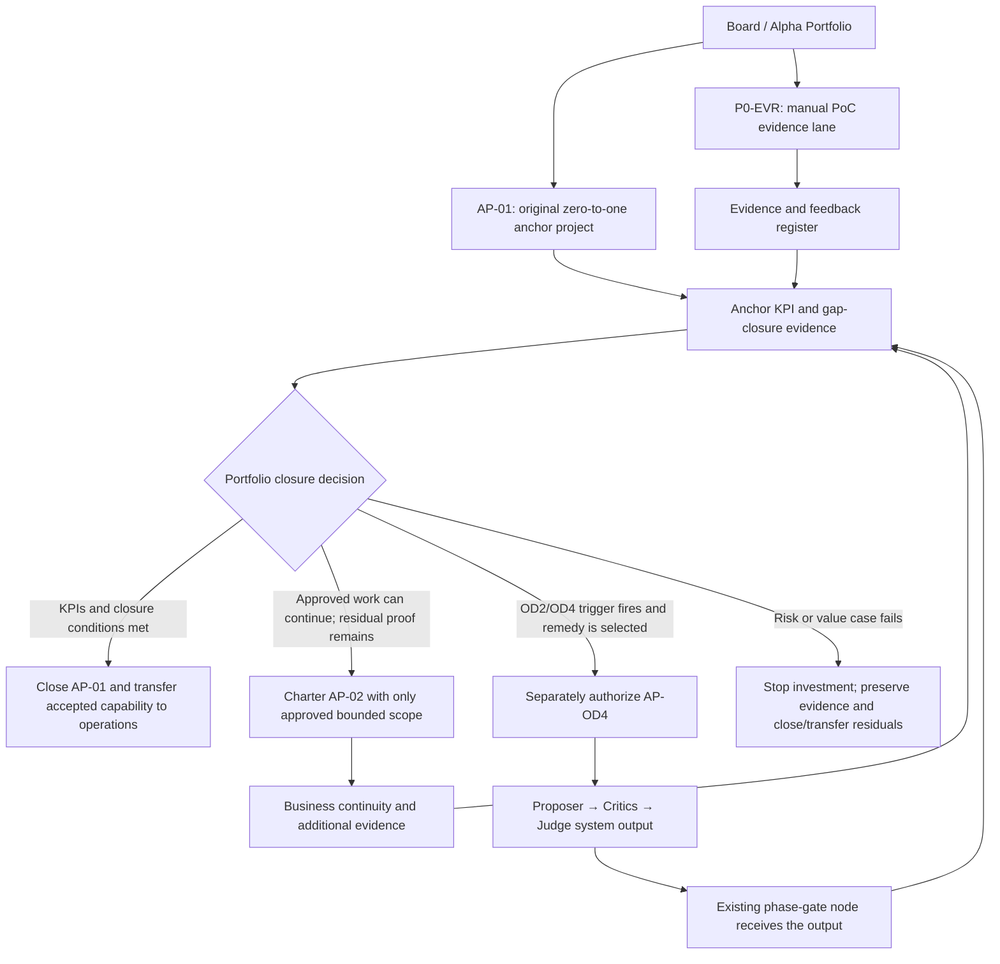
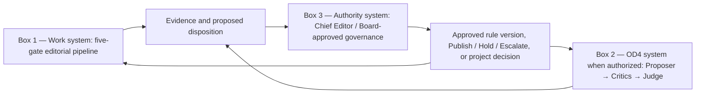

# Alpha Portfolio Business-Continuity and Project-Closure Implementation Plan

**Status:** Approved portfolio planning baseline where the operative Decision Register records an approval; otherwise planning only
**Change class:** Portfolio, project-closure, and evidence-planning analysis only  
**Build authorization:** None  
**Protected baselines:** `docs/PRD.md` and `docs/source/project-charter-v1.md` remain unchanged  
**Approval record:** `docs/v1/V1-DECISION-REGISTER.md`, including supplemental decisions `D-22`–`D-28` recorded 2026-08-19

## 1. Clarified prompt

> Consolidate the My-Editorial-App, Professional Evidence Review PoC, Media-Industry SOP fallback, and open-decision analysis into an Alpha Portfolio business-continuity plan. Treat the Alpha Portfolio as the continuing business and the original My-Editorial-App initiative as its approved zero-to-one anchor project. Preserve the approved `PRD.md` and frozen Project Charter as the historical and authorization baseline; resolving evidence gaps must not rewrite them or imply that the original go-to-market decision was wrong. Define how the anchor project reaches closure through its KPIs and gap evidence, how a narrowly chartered continuity project may proceed with only approved work if the anchor cannot safely complete, and how evidence continues to close or transfer the anchor project's residual gaps. Retain OD4 exactly as Proposer → Critics → Judge, implemented only as a separately governed system/project when its Charter trigger and a new authorization are satisfied. Break the work into small, affordable, low-liability decisions that one Chief Editor can execute. Do not build.

## 2. Primary goal

The goal is not to make one project contain the whole future business. It is to let the business continue while each temporary project carries only the risk, scope, authority, evidence duty, and closure test that it can honestly own.

The deeper tension is between:

- **continuity:** the business must keep learning, serving, and preserving cash;
- **baseline integrity:** the original approved demand and Charter cannot be rewritten to make later facts look inevitable;
- **evidence:** greenfield decisions such as OD1–OD3 require operating proof;
- **closure:** a project must end rather than become a permanent container for every unresolved business question; and
- **independent challenge:** the system performing editorial work must not be the sole authority assuring its own judgment.

The intended product of this plan is a portfolio operating model in which the “big elephant” is divided into small, separately approvable work packages that the “small frog”—one accountable Chief Editor with constrained cash, time, and access to counsel—can execute without pretending risk has disappeared.

## 3. Core conceptual evolution

### 3.1 Earlier framing

The earlier analysis treated each newly discovered gap as if it had to be resolved inside the original project. That created two distortions:

1. it implied that evidence might require changing the approved Charter or `PRD.md`; and
2. it overloaded OD4 by using it as a label for judgment-rule governance rather than preserving its approved meaning: Proposer → Critics → Judge.

This made the anchor project appear responsible for the whole business, the whole operating SOP, the whole risk environment, and the future autonomous system.

### 3.2 Corrected framing

The corrected model separates portfolio, project, product capability, operations, evidence, and independent challenge:

- the **Alpha Portfolio** is the continuing business and investment container;
- the **anchor project** is the approved zero-to-one initiative that proves or disproves a bounded business and product thesis;
- the **approved PRD and Charter** preserve the original decision basis and must not be rewritten after the fact;
- the **PoC evidence lane** tests the workflow manually and returns evidence to the portfolio;
- a **continuity project** may be chartered later to execute only approved, bounded work if the anchor cannot safely carry it;
- **OD4** remains a separately governed Proposer → Critics → Judge system, considered only when its existing trigger fires and the portfolio authorizes a new project; and
- the **Board and Chief Editor governance layer** approves rules and risk boundaries from outside the work-performing systems.

Under this model, a new project is not an admission that the anchor project was wrong. It is a controlled response to knowledge that did not exist at zero-to-one approval time.

## 4. Ontology and authority map

### 4.1 Human and institutional layers

| Layer | What is real at this layer | What must not be inferred |
|---|---|---|
| Human | The founder/Chief Editor experiences survival pressure, limited attention, limited funds, and personal responsibility | Personal urgency does not itself authorize publication, change scope, settle law, or prove market demand |
| Institutional | The Alpha Portfolio allocates capital, accepts or rejects risk, commissions projects, and owns business continuity | The portfolio does not possess human beliefs or conscience; its “values” must appear as decisions, controls, funding, and behavior |
| Editorial accountability | The Chief Editor makes the accountable operational disposition within approved authority | Accountability does not mean personally performing every task or allowing commercial pressure to replace evidence |
| Board authority | The Board approves risk envelopes, project initiation/closure, material rule changes, and exceptional intervention | Board authority should not erase the audit record or retroactively change the project's original baseline |

Personal stakes explain why the plan must be small. Institutional controls determine what the business is allowed to do.

### 4.2 Portfolio and project terms

| Term | Meaning in this plan | Duration | Authority source |
|---|---|---|---|
| **Alpha Portfolio** | The business-level container for strategy, capital, capabilities, risks, projects, and benefits | Continuing while the business continues | Board-approved portfolio governance |
| **Anchor Project / AP-01** | The original My-Editorial-App zero-to-one project authorized from `PRD.md` and the frozen Charter | Temporary | Existing approved baseline |
| **PoC evidence lane / P0-EVR** | A manual portfolio validation lane that exercises the same workflow and gathers customer/operating evidence | Time-boxed to the approved cohort and review | Existing PoC proposal if approved |
| **Continuity Project / AP-02** | A conditional new project limited to work already approved as safe and necessary for business continuation | Temporary; created only by a new charter | Future Board initiation decision |
| **OD4 System Project / AP-OD4** | A conditional separate Proposer → Critics → Judge system that supplies a node-level judgment product to the phase-gate workflow | Temporary build project followed by separately governed capability | Existing OD4 trigger plus future Board authorization |
| **Operations** | Repeatable business activity after a project transfers an accepted capability | Continuing | Approved SOP, role authority, budget, and service acceptance |
| **Residual gap** | Evidence, control, or authority still unresolved at a project decision point | Must have an owner, due date, treatment, and transfer/closure condition | Portfolio decision record |

The identifiers above are proposed portfolio labels only. They do not create projects or authority.

## 5. Portfolio architecture



The portfolio is the only box that sees all projects. No project gains authority merely because another project generated evidence useful to it.

## 6. Baseline protection rule

### 6.1 What stays frozen

1. `docs/PRD.md` remains the approved customer-demand record and original go-to-market authorization basis.
2. `docs/source/project-charter-v1.md` remains the frozen project baseline.
3. OD4 retains the text and meaning already recorded in that Charter.
4. Git history preserves the as-approved state and the later evidence trail.

### 6.2 How later learning is recorded

Later evidence belongs in:

- dated decision records;
- the feedback register;
- requirements traceability;
- the governed `Modular_PRD.md` supply specification where elaboration is authorized;
- editable downstream Addendum, Blueprint, Business Case, architecture, security, test, and task documents;
- a project-closure report; or
- the Charter and plan of a newly initiated project.

An explicit new customer request may authorize a new Product Scope proposal. It does not rewrite the historical `PRD.md`; it is appended as a dated demand/change record and assigned to the appropriate project.

### 6.3 What closure means

Closing the anchor project means the portfolio has decided that every project obligation is one of:

1. **Satisfied:** the KPI, deliverable, decision, or control has accepted evidence.
2. **Accepted residual:** the Board accepts a bounded residual risk with an owner and review date.
3. **Transferred:** a named gap and its evidence duty move to operations or a newly chartered project.
4. **Cancelled:** the value case or safe-delivery condition failed and further investment is stopped.

Closure does not require pretending every business uncertainty has vanished. It requires that no uncertainty remains ownerless or hidden inside an indefinitely open project.

### 6.4 Approved downstream Charter and financial interpretation

This section implements `D-22`–`D-28`. For AP-01 it is a downstream interpretation of the frozen Charter, not an edit to that Charter. A future project charter may include the clauses directly.

#### 6.4.1 Financial terms and reconciliation

| Term | Controlled meaning |
|---|---|
| **Provider Cost Baseline** | The provider's approved, time-phased delivery budget: base cost estimate plus contingency reserve for identified risks. It excludes the consumer's management reserve and the provider's margin |
| **Contract Price/Payment Baseline** | The contractually agreed amount payable by the customer, subject to payment milestones, acceptance terms, and authorized changes |
| **Legacy Commercial Cost Baseline** | Compatibility label for an older project where “Cost Baseline” meant the customer-payable amount. It maps to the Contract Price/Payment Baseline. New projects may not use this meaning without the qualifier |
| **Actual Project Cost** | Provider costs actually incurred for the project |
| **Invoiced Amount** | Amount billed under the contract; it is not automatically cash received or recognized revenue |
| **Cash Received** | Customer payments actually collected |
| **Recognized Project Revenue** | Revenue recognized as the contractual performance obligation is satisfied under the applicable accounting policy |
| **Other-Channel Revenue** | Separately attributable subscription, maintenance, licensing, syndication, or similar revenue. It requires a stated attribution rule and may not be double-counted as project-service revenue |
| **Contribution Margin** | Attributable recognized revenue less direct and allocated project costs. Use “profit” only after the approved overhead, finance, tax, and other allocation rules are applied |
| **Business Value** | Evidenced customer or business outcome. Price, cost, cash, or revenue alone does not prove value |

The provider's internal price reconciliation is:

```text
Base cost estimate
+ identified-risk contingency
= Provider Cost Baseline
+ provider margin or fee
= Contract Price/Payment Baseline
```

A consumer-held management reserve for unforeseen circumstances remains outside that reconciliation. It changes the provider's contract only through an authorized change. The provider plan may show the full internal build-up; a customer-facing document shows only the breakdown the contract or approved disclosure policy requires.

Portfolio profitability reporting keeps separate columns for Provider Cost Baseline, actual cost, Contract Price/Payment Baseline, invoices, cash received, recognized project revenue, other-channel revenue, and contribution margin. This permits older and newer projects to be normalized without retroactively changing their source terminology.

#### 6.4.2 Charter responsibility, accountability, and evidence

| Charter activity | Responsible | Accountable | Required record |
|---|---|---|---|
| Prepare and complete the Charter | Project Manager, supported by the assistant | Project Sponsor | Project Manager preparation certification |
| Authorize business purpose, scope envelope, funding, and project initiation | Project Sponsor | Project Sponsor | Attributable human Sponsor signature |
| Accept day-to-day project and task management | Project Manager | Project Manager | Attributable human Project Manager signature |
| Check document readiness | Assistant under Project Manager direction | Project Manager | Machine readiness attestation; not a signature |

**Project Sponsor signature block**

- Project Sponsor Name: Robert Tan
- Project Sponsor Title: Chief Editor
- Attestation: authorizes the Charter's business purpose, scope envelope, funding authority, risk acceptance, and authority to initiate the project.

**Project Manager signature block**

- Project Manager Name: Robert Tan
- Project Manager Title: Chief Editor
- Attestation: certifies Charter preparation completion and accepts accountability for day-to-day project management, task management, dependency control, cost control, delivery coordination, reporting, and escalation within the authorized Charter.

One Project Manager signature covers both preparation certification and operational role acceptance. It does not need to be duplicated as a third signature.

**Project-management assistant record**

- Assistant: ChatGPT Codex
- Permitted evidence: document version, timestamp, checks performed, source reconciliation, unresolved conditions, and readiness recommendation.
- Boundary: the machine readiness attestation is not a human signature, scope or funding approval, liability acceptance, or independent assurance.

For the present zero-to-one business, Robert Tan occupies both named human roles and signs in each capacity. That is an explicit role-concentration exception, not separation of duties. If a rule later requires distinct human occupants, the exception cannot satisfy it; a second authorized human must be appointed.

This project-governance allocation does not alter the editorial task matrix's statement that the Acting Chief Editor is the invariant accountable human for T1–T11. The matrices govern different institutional objects: project authorization and management here, editorial transitions in the RACI document.

Interpretive sources: [PMI cost-baseline explanation](https://www.pmi.org/-/media/pmi/documents/public/pdf/pmbok-standards/errata-sheet-qas-6th.pdf), [PMI fixed-price price build-up and reserve guidance](https://www.pmi.org/learning/library/challenges-fixed-price-contracts-9640), [IFRS 15 revenue overview](https://www.ifrs.org/issued-standards/list-of-standards/ifrs-15-revenue-from-contracts-with-customers/), and [OpenAI product-capability overview](https://developers.openai.com/). These sources support terminology and tool capability; they do not replace contract-, jurisdiction-, or accounting-specific review.

## 7. Anchor-project closure scorecard

### 7.1 Original success evidence

The anchor project preserves the original `PRD.md` success criteria:

- 5+ articles logged and moving through the pipeline in the defined week;
- 2+ published to WordPress or marked ready for manual LinkedIn publication;
- the board can be filtered by state, topic, and category;
- every transition records who, when, and why; and
- zero sequence bypasses.

These remain evidence of delivery. They are not alone sufficient for production or project closure where identified governance, security, rights, or operating gaps remain unresolved.

### 7.2 Closure dimensions

| Dimension | Minimum evidence | Closure treatment |
|---|---|---|
| Original demand | `PRD.md` success scenario demonstrated without altering the demand statement | Satisfied or value-case failure recorded |
| Product/technical acceptance | Approved acceptance criteria and tests for the bounded capability | Satisfied or transferred to AP-02 |
| Sequence and audit integrity | No bypass; append-only and attributable transitions; invalid writes rejected | Satisfied before production use |
| OD1 | Dated downstream decision identifies the human's touchpoints and delegation boundary | Resolved by authorized decision; Charter text remains frozen |
| OD2 | Evidence and dated downstream decision determine whether successor review provides sufficient independence | Affirmative resolution, or Charter branch ② hard stop/remedy |
| OD3 | Dated decision defines the count and distribution needed for the approved operating model | Resolved, explicitly deferred to AP-02, or scope cannot enter operations |
| OD4 | Existing OD4 remains deferred unless one of its triggers fires | Preserved, triggered into AP-OD4, or carried forward exactly as written |
| FB-01–FB-08 | Each has an approved disposition and actual closure/transfer artifact | Closed or transferred; “disposition approved” is not “gap closed” |
| Legal/contract/platform boundary | Known coverage or an approved low-risk exclusion/hold rule for unknowns | Bounded residual or transferred; no invented certainty |
| Operations handoff | Owner, SOP, support boundary, budget, incident/remedy path, and benefit measurement | Accepted by operations/portfolio |
| Commercial evidence | Actual payment/outcome evidence from the bounded PoC, including negative evidence | Supports continue/tune/stop decision; does not control editorial truth |

### 7.3 Closure decision

The Board receives one closure pack containing:

1. original KPI evidence;
2. gap register with `Satisfied`, `Accepted residual`, `Transferred`, or `Cancelled` treatment;
3. open-decision records and dissent;
4. security, rights, platform, and operational acceptance;
5. costs incurred and remaining exposure;
6. benefits/product-market evidence;
7. asset and knowledge transfer list; and
8. recommendation to close, continue for a fixed period, transfer, or stop.

The decision should never be “keep the anchor project open until the whole business is solved.”

## 8. Continuity branch when the anchor cannot complete safely

AP-02 is created only when all of these conditions hold:

1. the Board identifies a subset of work already approved and safe enough to proceed;
2. that subset can produce business continuity or decision evidence without bypassing the anchor's hard stops;
3. the scope, budget, duration, owner, risks, KPIs, and stop-loss are stated in a new project charter;
4. every dependency on AP-01 is named rather than copied silently;
5. no unresolved anchor assumption is represented as settled in AP-02; and
6. the Board states whether each residual gap remains with AP-01 closure work or transfers to AP-02.

When AP-02 starts, AP-01 enters **controlled closure**: it performs only the named evidence, decision, handover, and closure tasks still assigned to it. It accepts no new delivery scope. A shared dependency has one accountable owner and may be referenced by both projects, but it is not funded or reported as two separate pieces of work.

### 8.1 AP-02 may do

- perform approved manual Professional Evidence Review engagements;
- collect customer payment and outcome evidence outside the application;
- run low-liability workflow and control table-tops;
- improve manual SOPs inside the approved risk envelope;
- operate approved portions of the five-gate process;
- produce decision evidence needed by the portfolio; and
- prepare traceable change proposals for a later authorization.

### 8.2 AP-02 may not do merely because continuity is urgent

- rewrite `PRD.md` or the frozen Charter;
- declare OD1–OD3 closed without the required evidence and authority;
- treat OD4 as adopted;
- bypass an OD2 hard stop;
- build unapproved features, autonomous publishing, scraping, or payment systems;
- accept high-liability work without the approved escalation path;
- use client payment as authority over editorial judgment; or
- absorb the entire residual scope of AP-01.

This is the portfolio's smallest viable continuation: keep approved value moving while isolating the unresolved proof burden.

## 9. OD4 as a retained separate system

### 9.1 Meaning that must be preserved

OD4 means **Proposer → Critics → Judge**. It is not a synonym for:

- house SOP;
- judgment-rule version control;
- Chief Editor authority;
- phase-gate review;
- ordinary model self-critique; or
- a reason to rewrite the anchor Charter.

The phase gates remain the **inter-node work and successor-review system**. OD4 is a potential **separate intra-node judgment system** whose output is handed to a phase-gate node and then reviewed by the existing successor mechanism.

### 9.2 Three-box control model



The control principle is structural: the same box should not exclusively create the answer, define the rule, validate compliance with the rule, and approve its own release. Independent governance sits outside both software systems.

### 9.3 Trigger and project rule

OD4 remains deferred exactly as recorded. If an existing trigger fires:

1. record the trigger and evidence;
2. stop where the frozen Charter requires a stop;
3. compare OD4 with other remedies;
4. if selected, create a new AP-OD4 business case and project charter;
5. define inputs, outputs, independence, evaluation, rule authority, failure containment, and handoff to the phase gates;
6. validate in shadow/manual mode before any operational reliance; and
7. require a separate Board production decision.

Judgment-rule governance remains a portfolio/Chief Editor institutional process outside OD4. OD4 may apply approved rules; it may not approve the rules governing itself.

## 10. “Big elephant / small frog” execution model

### Bite 1 — protect the box boundaries

**Decision:** ratify the portfolio map, baseline protection rule, and project identifiers.  
**Artifact:** one-page Alpha Portfolio mandate and responsibility map.  
**Exit:** everyone can distinguish the business, AP-01, P0-EVR, conditional AP-02, conditional AP-OD4, and operations.

### Bite 2 — freeze the anchor closure checklist

**Decision:** approve the closure dimensions in §7 without changing the Charter or `PRD.md`.  
**Artifact:** AP-01 closure scorecard populated with evidence owner and status.  
**Exit:** every KPI, OD, feedback item, technical control, and handoff has an owner and closure/transfer rule.

### Bite 3 — authorize only the manual PoC

**Decision:** approve or reject the existing `B-P0-*` PoC resolutions and low-liability boundary.  
**Artifact:** signed PoC decision pack with spend, time, topic, rights, and stop limits.  
**Exit:** a 5–10-case, one-case-at-a-time lane can run without a product build.

### Bite 4 — collect decision evidence, not more scope

**Decision:** no scope decision during a case.  
**Artifact:** per-case Editorial Briefcase, gate log, gap evidence, customer outcome, and exception record.  
**Exit:** observed facts are separable from proposals and approvals.

### Bite 5 — close the feedback dispositions

**Decision:** review FB-01–FB-08 individually using the PoC crosswalk.  
**Artifact:** one approval/closure record per feedback item.  
**Exit:** ready documentation items close; evidence-dependent items are accepted, transferred, or kept open visibly.

### Bite 6 — decide the anchor branch

**Decision:** close AP-01, grant a short fixed extension, charter AP-02, initiate an OD4 remedy review, or stop.  
**Artifact:** Board closure/branch resolution.  
**Exit:** no indefinite project and no implicit transfer of authority.

### Bite 7 — transfer only accepted capability

**Decision:** operations accepts a bounded service, or a new project accepts named deliverables and residual gaps.  
**Artifact:** handover/acceptance record.  
**Exit:** ownership, budget, risk, and benefit measurement move together.

## 11. Chief Editor operating limits

To make the plan executable by one accountable person:

- work in progress is one live paid PoC case at a time;
- the initial cohort remains 5–10 low-liability cases;
- unknown jurisdiction, contract, rights, counsel, or authority fields remain `UNSET` and can trigger a hold;
- Board review receives an exception summary, not every raw artifact;
- each gap gets one owner, one next evidence item, and one decision date;
- spending, elapsed time, uncompensated rework, and high-risk exposure have Board-set stop-loss limits;
- no software build is used to avoid making an authority decision;
- no high-liability whistleblower or source-protection case is accepted merely to test the control; and
- personal survival pressure is answered with workload, cash, and risk limits—not by relaxing editorial gates.

## 12. Portfolio decisions — operative status recorded elsewhere

| ID | Decision | Effect |
|---|---|---|
| APD-01 | Recognize the Alpha Portfolio as the continuing business container and AP-01 as its temporary zero-to-one anchor project | Stops the anchor project from becoming the whole business architecture |
| APD-02 | Freeze `PRD.md` and the v1 Project Charter as the original approved baseline | Later evidence is appended downstream or assigned to a new project |
| APD-03 | Approve the AP-01 closure scorecard and four permitted gap treatments | Gives the project a finite, auditable ending |
| APD-04 | Classify P0-EVR as a time-boxed portfolio evidence lane using the same workflow, not a product pivot | Permits learning without changing the anchor baseline |
| APD-05 | Permit AP-02 only through a new Board-approved charter limited to safe, already approved work | Protects continuity without silent scope expansion |
| APD-06 | Retain OD4 exactly as Proposer → Critics → Judge and prohibit using “OD4” for rule governance | Removes the conceptual collision |
| APD-07 | Require AP-OD4 to be a separate project/system if an existing OD4 trigger fires and the remedy is selected | Prevents the work system from self-authorizing its assurance system |
| APD-08 | Place judgment-rule approval outside both the phase-gate system and OD4 system | Preserves independent institutional control |
| APD-09 | Approve one-case WIP, cohort, cost, time, topic, rights, and risk stop-loss limits | Makes continuity executable by the Chief Editor |
| APD-10 | Require a portfolio closure/branch decision after the evidence window | Prevents indefinite analysis and project limbo |

The authoritative approval status and conditions are recorded in `docs/v1/V1-DECISION-REGISTER.md`. This section explains the decisions and does not resubmit or reopen an item already approved there.

## 13. Guaranteed failure modes

| Failure | Boundary that collapses | Stronger control |
|---|---|---|
| Rewrite `PRD.md` to fit later evidence | Historical customer demand versus later learning | Preserve the baseline; append a dated request or charter a new project |
| Treat a successor project as proof AP-01 failed | Project learning versus strategic invalidity | Record which assumption changed and why portfolio continuation remains justified |
| Keep AP-01 permanently open until the whole business is solved | Temporary project versus continuing portfolio | Use satisfied/accepted/transferred/cancelled closure treatments |
| Let AP-02 inherit all unresolved scope | Approved continuation versus scope laundering | New charter, explicit exclusions, named dependencies, and stop-loss |
| Rename rule governance “OD4” | Institutional authority process versus Proposer/Critics/Judge system | Preserve OD4 and give rule governance a separate portfolio control identity |
| Let OD4 approve its own rules | Work/challenge system versus authority system | Chief Editor/Board governance outside the system, with version and rollback evidence |
| Use the PoC to prove liability reduction | Small operating sample versus causal/legal assurance | Measure control coverage and incidents; retain residual uncertainty |
| Let payment settle editorial value | Commercial demand versus public-interest and evidential judgment | Keep commercial and editorial decisions separately recorded |
| Create several projects without capacity control | Portfolio flexibility versus coordination overload | One active continuity lane, WIP limit, explicit priority and shared dependency register |
| Protect the business by overloading the founder | Institutional continuity versus human sustainability | Time, workload, escalation, and stop-loss limits owned by the Board |

## 14. Preservation layer

Future revisions must preserve:

- the business/portfolio is continuing; projects are temporary;
- `PRD.md` and the original Charter preserve the approved zero-to-one decision basis;
- later evidence does not make the original decision retrospectively “wrong”;
- resolving an open Charter decision downstream does not require editing the frozen Charter;
- project closure is different from product discontinuation or business closure;
- transferred residual gaps remain visible and owned;
- P0-EVR is an evidence lane using the same workflow, not a replacement product;
- AP-02 requires a new charter and cannot absorb unapproved work;
- OD4 means only Proposer → Critics → Judge and remains a separate system;
- judgment-rule authority sits outside the systems that apply those rules;
- sequence integrity, judgment independence, and business continuity remain different control questions; and
- human survival pressure and institutional authority remain separate even when both are urgent.

## 15. Current state

The strongest current synthesis is a portfolio with one protected historical anchor, one bounded manual evidence lane, and two conditional branches rather than one overloaded mega-project. AP-01 keeps its approved zero-to-one meaning. P0-EVR produces evidence. AP-02 exists only if the Board needs a narrow continuity vehicle. AP-OD4 exists only if the retained Charter trigger fires and the Board separately authorizes the Proposer → Critics → Judge system.

The open work is institutional rather than technical: execute the approved portfolio map, define the anchor closure scorecard, settle the still-deferred PoC numbers, resolve or transfer OD1–OD3 through dated downstream acts, preserve OD4, establish independent rule authority, and set a mandatory closure/branch date.

## 16. Next-step architecture — no build

1. Use the APD outcomes and conditions already recorded in the operative Decision Register; do not resubmit approved items. Complete only their named follow-ups.
2. The Chief Editor populates the AP-01 closure scorecard from existing evidence without changing `PRD.md` or the Charter.
3. The existing PoC decision packet is reconciled to the portfolio map and approved/rejected.
4. The 5–10-case manual evidence lane runs under one-case WIP and stop-loss limits.
5. FB-01–FB-08 and OD1–OD3 receive separate evidence/authority/closure records.
6. The Board makes the AP-01 closure/extension/AP-02/AP-OD4/stop decision on the fixed review date.
7. Only a later, separately scoped authorization may initiate software implementation.

## 17. Source and authority references

This plan interprets but does not amend:

- [Original approved demand — PRD.md](../PRD.md)
- [Frozen Project Charter v1](../source/project-charter-v1.md)
- [Governing-document rules](../source/README.md)
- [RACI involvement and retained OD4 architecture](raci-involvement-matrix.md)
- [Professional Evidence Review PoC proposal](board-proposal-professional-evidence-review-poc.md)
- [PoC feedback approval crosswalk](poc-feedback-approval-crosswalk.md)
- [Media-Industry SOP fallback plan](media-industry-sop-fallback-implementation-plan.md)
- [Requirements traceability map](requirements-traceability-map.md)

If this plan conflicts with an approved governing document, the governing document controls. Its authority is limited to the decisions and conditions recorded in the operative Decision Register; unrecorded proposals remain non-authoritative.
