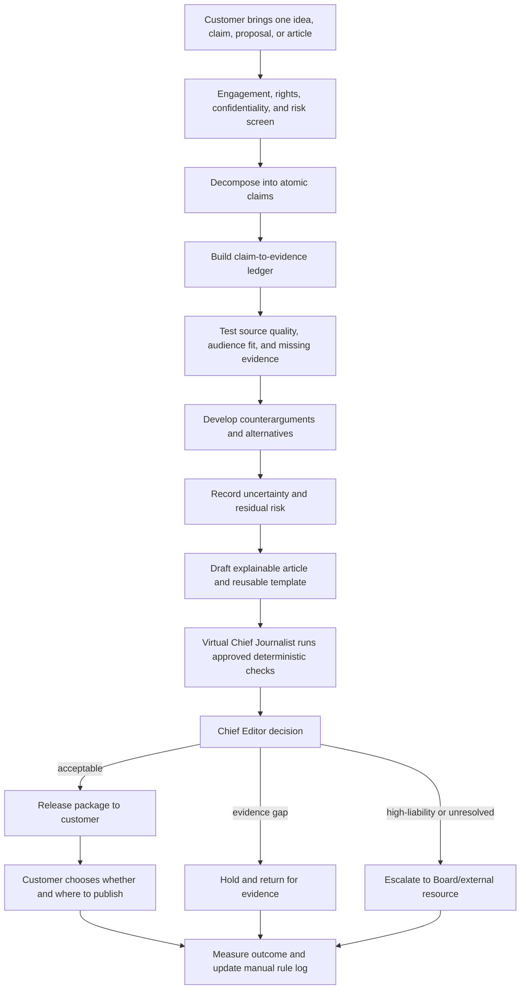

# Board Proposal — Professional Evidence Review Proof of Concept

**Status:** Draft for Board approval  
**Change class:** Business-model and Product Scope proposal; planning only  
**Build authorization:** None  
**Relationship to existing plan:** This proposal precedes and may replace the current Sprint 1 scope if approved. It does not amend the Charter, PRD, sprint plan, schema, or application by itself.

## 1. Clarified prompt

> Prepare a Board-approval proposal for a service-led proof of concept called the **Professional Evidence Review Sprint**. Record the Chief Editor as the final editorial `Release/Hold/Escalate` authority, with Board intervention for high-liability matters and a virtual Chief Journalist serving only as a deterministic workflow assistant. Because jurisdiction, retained counsel, and quantitative OD2 thresholds are not yet available, use public editorial, platform, regulator, mediation, and journalist-support resources as provisional continuity inputs, while explicitly stating that they are not legal clearance. Run the workflow manually for 5–10 professionals, charge manually for the completed outcome, identify repeatable steps, and propose automation only after paid demand and quality evidence exist. Preserve the long-term Evidence → Intelligence → Decision → Action → Learning → Publication architecture. Do not build or modify governing documents yet.

## 2. Resolution requested

The Board is asked to approve a **manual concierge discovery PoC** before software Sprint 1:

> A professional supplies one article, idea, proposal, or professional claim. The service converts it into structured claims, an evidence review, counterarguments, an uncertainty assessment, an explainable article, and a reusable publishing template. The Chief Editor releases, holds, or escalates the completed package. The customer controls whether and where they publish it.

The PoC tests whether professionals will repeatedly pay for a credible, evidence-aware publishing outcome before the business automates the workflow.

## 3. Why this is not merely a smaller Sprint 1

The current governed product and this proposal have different commercial and operational objects:

| Dimension | Current governed plan | Proposed PoC | Consequence |
|---|---|---|---|
| Customer | One internal Chief Editor | 5–10 external professionals | Customer and tenancy assumptions change |
| Job | Track curated source articles through an editorial pipeline | Transform a customer's claim/idea into an evidence-reviewed article package | Core object and workflow change |
| Revenue | NG-03: no monetization features | Charge for the outcome | Business-model change; payment can remain off-platform |
| Accounts | NG-02: single account | Multiple service customers | Do not build accounts before the manual workflow proves demand |
| Publication | WordPress/LinkedIn workflow | Customer receives a reusable article/template | Direct publishing can remain out of PoC |
| Validation | Gate compliance | Paid demand plus evidence quality and time-to-outcome | New success criteria |

Calling this “scaled-down Sprint 1” would hide a pivot and risk building the existing schema for the wrong customer. If the Board approves the PoC, it should receive a distinct discovery identifier such as **P0-EVR**; only after the manual evidence review should the Board decide whether to amend or replace Sprint 1.

## 4. Strategic proposition

### 4.1 Mission

> Build a small AI-assisted system that helps professionals turn evidence and experience into explainable decisions and trustworthy public knowledge.

“Trustworthy” is not a marketing guarantee. In this proposal it means the output exposes claim provenance, source quality, counterarguments, unresolved uncertainty, and the accountable release decision.

### 4.2 First offer

**Name:** Professional Evidence Review Sprint  
**Buyer:** A professional with subject-matter experience who wants to publish an evidence-aware article  
**Input:** One article, idea, proposal, or professional claim  
**Output:**

- structured claims;
- a claim-to-evidence ledger;
- source-quality and relevance review;
- counterarguments and alternative interpretations;
- uncertainty and missing-evidence assessment;
- final explainable article;
- reusable publishing template; and
- an audit record of the Chief Editor's release, hold, or escalation decision.

### 4.3 Long-term architecture

```text
Evidence → Intelligence → Decision → Action → Learning → Publication
     ▲                                                        │
     └──────────────────── measured feedback ─────────────────┘
```

The PoC validates only the shortest commercially meaningful path:

```text
Evidence → Reasoning → Explainable article package → Customer outcome → Learning
```

Broader decision intelligence, execution management, and autonomous publication remain future hypotheses.

## 5. Recorded P0 answers and their decision status

| P0 question | Recorded answer | Planning interpretation | Status |
|---|---|---|---|
| Jurisdiction, regulation, contracts, counsel | Business will rely provisionally on public resources, public mediation, and good practice while attracting counsel | Operating jurisdiction, applicable regulator, and contracts remain **UNSET**. Public resources support continuity but do not constitute representation or clearance | Open risk; does not authorize high-liability release |
| Final editorial authority | Chief Editor has final say; Board may override on high-liability matters; Chief Journalist is virtual | Chief Editor owns ordinary release. Board holds risk-oversight authority. Exact override limits require Board approval in §8 | Proposed resolution |
| OD2 threshold/system halt | Use simple public fallback because this autonomous flow and business are new | PoC uses qualitative red flags, mandatory manual review, and no autonomous release. Numeric thresholds are deliberately deferred until evidence exists | Proposed provisional control |
| OD4 rule governance | Chief Editor governs rules; automation follows manual fine-tuning | Chief Editor owns editorial rules and versions. Board owns risk envelope. Virtual agents execute only an approved version | Proposed resolution |
| SOP precedence | Submit a proposal to the Board | §10 is the proposed precedence order | Pending Board approval |

## 6. PoC scope

### 6.1 Included

1. Recruit 5–10 professionals individually.
2. Perform the entire evidence-review workflow manually with AI assistance.
3. Use public sources, standards, references, and customer-supplied experience.
4. Produce one evidence package and one article/template per engagement.
5. Record time, judgment points, revisions, exceptions, and customer feedback.
6. Charge manually for the completed service outcome; do not build payment features.
7. Identify repeated steps only after several real engagements expose them.
8. Recommend a thin software scope only after the evidence review in §13.

### 6.2 Excluded from the PoC

- autonomous publication;
- unattended agent decisions;
- automated LinkedIn activity or credential sharing;
- customer accounts, multi-tenancy, or self-service onboarding;
- in-app payment or Stripe work;
- broad trend crawling or real-time trend detection;
- promises of legal review or legal accuracy;
- personalized medical, legal, investment, or other regulated professional advice;
- publication of high-liability allegations without external review;
- confidential-source or whistleblower publication without a safe escalation route;
- broader project/decision-intelligence features; and
- changes to the existing Supabase schema or migrations.

The Board may later move an excluded item into scope, but only through an explicit scope and risk decision.

## 7. Manual workflow



For this PoC, **Release** means releasing the completed article package to the customer. It does not mean the system pushes content to WordPress, LinkedIn, or any other platform.

## 8. Decision rights

### 8.1 Proposed authority model

| Actor | Authority | Explicit limit |
|---|---|---|
| Chief Editor | Final ordinary `Release/Hold/Escalate` decision; owns article quality and editorial-rule versions | Cannot represent public resources as legal clearance; cannot waive Board-defined high-liability escalation |
| Board of Directors | Sets risk appetite and PoC scope; may require `Hold` or `Escalate` for high-liability matters; accepts business risk | Should not force release against a Chief Editor hold, rewrite factual conclusions, or force confidential-source disclosure without lawful process and external advice |
| Virtual Chief Journalist | Runs the approved checklist, checks completeness, synthesizes evidence and disagreements, recommends a disposition | No independent release authority; cannot change its rule version or bypass Chief Editor review |
| Customer | Supplies materials, reviews the package, and controls external publication in the PoC | Cannot require the service to state unsupported claims as fact or bypass holds inside the service |

### 8.2 High-liability two-key recommendation

For a high-liability item, release should require both:

1. Chief Editor editorial approval; and
2. Board risk acceptance or an approved external-review outcome.

Either party may hold or escalate. Neither party alone may force release. This preserves Board oversight without converting editorial independence into a decorative label.

Every Board intervention should record the matter, risk basis, evidence considered, decision, dissent, authority, and date.

## 9. Simple OD2 compensating control

The PoC does not need a speculative numeric score. It uses a short qualitative rule:

> No package is released autonomously. Every package must show its claims, evidence, counterarguments, and uncertainty and receive Chief Editor review. Any high-liability red flag causes an item-level hold or escalation.

### 9.1 Article-level red flags

- a material claim lacks a source or relies on circular citation;
- the source is not positioned to know;
- important evidence contradicts the proposed conclusion;
- a named person or organization is accused of wrongdoing;
- confidential, private, personal, embargoed, or proprietary information is involved;
- the package could reasonably be interpreted as regulated professional advice;
- copyright/license rights are unclear;
- a contract, platform policy, regulator, court, or Board restriction may be triggered;
- the subject has not received a fair opportunity to respond where fairness requires it; or
- the AI and human review disagree on a material fact and the disagreement cannot be resolved.

One red flag holds or escalates the affected engagement. It does not stop unrelated work.

### 9.2 System-wide halt conditions

All release work pauses only when a failure affects the reliability of the service as a whole:

- evidence/audit records cannot be trusted or reconstructed;
- content is released without Chief Editor authorization;
- customer, source, or publishing credentials/data are compromised;
- the active judgment-rule version is unknown, corrupted, or changed without approval;
- the Board/external escalation route is unavailable while high-liability packages remain queued;
- a binding authority orders the service or relevant publication channel to stop; or
- the Chief Editor and Board determine that a recurring control failure affects multiple engagements.

No invented incident count is proposed for the final item. The PoC must first collect real failure data.

## 10. Proposed SOP precedence

When instructions conflict, apply this order and record the conflict:

1. **Binding law, court order, and regulator direction** in the applicable jurisdiction.
2. **Human safety, confidential-source promises, and personal-data protection:** conflicts trigger hold and external advice; the system never discloses a source automatically.
3. **Applicable contracts, licenses, embargoes, and platform rules.** If a term conflicts with law, ethics, or a source promise, hold and escalate rather than guessing.
4. **Board-approved risk appetite and PoC boundaries.** The Board sets what the business is willing and equipped to handle.
5. **Board-approved house SOP and Chief Editor editorial judgment.** These determine evidential sufficiency, fairness, clarity, and release readiness.
6. **Customer requests and preferences.** These shape the deliverable but cannot override higher obligations.
7. **Virtual-agent recommendation.** Automation is evidence for a decision, never the governing authority.

Editorial independence is operationalized through the two-key rule, recorded dissent, protected source handling, and the prohibition on forced release—not through a claim that the organization “believes” in independence.

## 11. Public-resource continuity plan

Until the business retains counsel, maintain a dated resource register rather than claiming legal coverage:

| Need | Provisional public resource | Limitation |
|---|---|---|
| Editorial standards | Reuters, AP, SPJ, IPSO, UNESCO standards already listed in the media-SOP plan | Standards are not jurisdiction-specific advice |
| Platform exposure | [LinkedIn Professional Community Policies](https://www.linkedin.com/legal/professional-community-policies) | Applies to LinkedIn use and may change; the PoC should not automate LinkedIn actions |
| Hosted publishing exposure | [WordPress.com User Guidelines](https://wordpress.com/support/user-guidelines/) if WordPress.com is actually used | Self-hosted WordPress follows the host, contracts, and local law instead |
| International media-law support | [Media Defence](https://www.mediadefence.org/ar/emergency-defence/) | Eligibility, capacity, and representation are not guaranteed |
| Journalist safety/emergency help | [Committee to Protect Journalists](https://cpj.org/emergency-response/how-to-get-help/) and [Reporters Without Borders](https://rsf.org/en/assistance-journalists-and-media) | Intended for qualifying press-freedom or safety situations, not routine commercial review |
| Mediation/ombuds/regulator guidance | The official body for the actual jurisdiction once identified | No universal public mediation centre has jurisdiction over every engagement |

For every engagement, record the customer's location, intended publication location, subject location, platform, and relevant contract. This does not resolve jurisdiction; it identifies what must be checked.

## 12. OD4 judgment-rule governance

### 12.1 Manual-first governance

The Chief Editor owns the content of the judgment rules. The Board approves the risk envelope and high-liability categories. During the PoC:

- store the rules in a dated manual;
- assign a version to every completed engagement;
- record every exception, override, correction, and customer dispute;
- test proposed rule changes against prior cases before adoption;
- obtain Chief Editor approval for ordinary editorial-rule changes;
- obtain Board approval when a change alters risk appetite or high-liability scope; and
- keep the prior version available for rollback.

The virtual Chief Journalist executes the approved version and cannot self-modify it.

### 12.2 Automation gate

A repeated step becomes an automation candidate only when:

1. it appears across multiple paid engagements;
2. inputs and outputs can be stated unambiguously;
3. failure is detectable;
4. a human fallback exists;
5. automation does not acquire release authority; and
6. the time/risk benefit is observable.

## 13. Product-market evidence

### 13.1 Domino sequence

1. Choose **evidence-aware professional publishing**.
2. Perform the workflow personally for 5–10 professionals.
3. Identify repeated steps and judgment bottlenecks.
4. Build only the validated repeated steps into My-Editorial-App.
5. Charge for the completed outcome, initially off-platform.
6. Measure whether customers produce more credible content faster.
7. Expand toward decision intelligence only after evidence supports it.

### 13.2 Measurements

| Evidence question | Measure during the PoC | What it can justify |
|---|---|---|
| Will anyone pay? | Paid versus unpaid engagements; price objections; payment completion | Commercial demand, not product scalability |
| Is the job recurrent? | Repeat purchase, second article request, referrals | Repeatability |
| Which steps repeat? | Time and revisions by workflow stage | Automation candidates |
| Does the output become usable public knowledge? | Customer acceptance, external publication, reuse of template | Outcome usefulness |
| Is it evidence-aware? | Material claims linked to sources; counterarguments included; uncertainty disclosed | Process quality |
| Is it faster? | Customer and Chief Editor elapsed/active time versus the customer's prior method | Efficiency improvement |
| Does it reduce avoidable harm? | Holds, evidence gaps found, corrections, complaints, retractions, source/privacy incidents | Risk signals; no causal savings claim without a baseline |

Do not use “trustworthy” or “credible” as self-reported success by themselves. The observable proxies are provenance completeness, challenge quality, uncertainty disclosure, correction history, and customer reuse.

### 13.3 Evidence review after 5–10 engagements

The Board receives:

- demand and willingness-to-pay evidence;
- a workflow heat map showing repeated manual work;
- common evidence defects and risk flags;
- quality/risk outcomes;
- customer segment differences;
- proposed Product Scope for the smallest useful software;
- explicit do-not-automate steps; and
- a recommendation to proceed, revise, pause, or stop.

## 14. Anticipated smallest software scope — not authorized

If the evidence supports building, likely candidates are:

- structured intake for one professional claim/article;
- claim decomposition;
- claim-to-source evidence ledger;
- counterargument and uncertainty workspace;
- reusable article/template generation;
- Chief Editor `Release/Hold/Escalate` record;
- judgment-rule version and audit trail; and
- customer export/download.

This list is a hypothesis. It is not a backlog, schema, or implementation authorization.

## 15. Guaranteed failure modes

| Failure mode | What collapses | Planned prevention |
|---|---|---|
| Build the existing article tracker and call it this PoC | Internal editorial tool versus external professional service | Board approves the pivot before any Sprint 1 work |
| Say “mass public” while interviewing 5–10 mixed users | Long-term market versus first customer segment | Recruit a narrow professional segment and record selection criteria |
| Build payments because the service charges | Monetization validation versus payment infrastructure | Invoice or collect manually; automate only after repeat demand |
| Call public resources “counsel” | Information versus representation | Keep jurisdiction/counsel status UNSET and high-liability items held |
| Let the Board force publication | Risk oversight versus editorial evidence | Two-key high-liability release; either party may hold |
| Let a virtual Chief Journalist approve release | Workflow execution versus authority | Deterministic check and recommendation only |
| Use “credible” as a brand adjective | Trust signaling versus operational evidence | Measure provenance, challenge, uncertainty, and correction history |
| Train automation from unreviewed manual decisions | Repetition versus correctness | Reviewed cases, versioned rules, test set, and rollback |
| Publish whistleblower allegations to prove courage | Source protection/public interest versus reckless publication | Hold, protect, corroborate, seek reply, and obtain external review |
| Treat a customer article as customer-owned evidence | Authorship versus rights to underlying sources/materials | Rights and license screen at intake |

## 16. Board approval form

The Board should record Approve / Reject / Amend for each item:

| ID | Decision requested | Board response |
|---|---|---|
| B-P0-01 | Approve P0-EVR as a manual concierge discovery PoC for 5–10 professionals before software Sprint 1 | Pending |
| B-P0-02 | Approve the Professional Evidence Review Sprint offer and listed outputs | Pending |
| B-P0-03 | Approve off-platform charging with no payment-feature build | Pending |
| B-P0-04 | Approve Chief Editor final ordinary release authority and the high-liability two-key rule | Pending |
| B-P0-05 | Approve the qualitative OD2 fallback and system-halt conditions | Pending |
| B-P0-06 | Approve Chief Editor ownership of judgment rules and Board ownership of the risk envelope | Pending |
| B-P0-07 | Approve the SOP precedence order | Pending |
| B-P0-08 | Accept jurisdiction and retained-counsel status as UNSET and the resulting high-liability exclusions | Pending |
| B-P0-09 | Approve the measurement and post-engagement evidence review | Pending |
| B-P0-10 | Confirm that this proposal grants no build, migration, autonomous-publication, or governing-document authority | Pending |

Approval must identify approver, date, conditions, dissent, and review date. Silence is not approval.

## 17. Implementation sequence — planning and manual validation only

### Stage 0 — Board decision

- Review B-P0-01…10.
- Record amendments and approval evidence.
- If rejected, keep the existing PRD/Sprint 1 unchanged.

### Stage 1 — manual SOP pack

After Board approval, draft without application code:

- engagement intake and rights/risk screen;
- claim/evidence/counterargument/uncertainty templates;
- Chief Editor decision record;
- high-liability and escalation checklist;
- customer feedback/outcome form;
- judgment-rule manual v0.1; and
- public-resource and platform-policy register.

Any customer terms, disclaimers, confidentiality promises, or limitation-of-liability language remain draft until the applicable jurisdiction and review route are known.

### Stage 2 — five-to-ten manual engagements

- Execute one engagement at a time.
- Keep customer and source data separated.
- Apply Chief Editor review to every package.
- Hold/exclude high-liability work when the escalation route is inadequate.
- Collect the measurements in §13.

### Stage 3 — Board evidence review

- Decide whether paid demand is repeatable.
- Select the smallest repeated steps worth automating.
- Decide whether this proposal replaces, branches from, or is rejected in favor of the existing product.
- Only then authorize PRD, traceability, architecture, data-model, task, and sprint-plan amendments.

### Stage 4 — build authorization, if any

No build begins until amended governing documents define the customer, Product Scope, Project Scope, data boundary, access model, acceptance tests, and deployment plan. The existing schema must not be adapted informally to this pivot.

## 18. Preservation layer

Future revisions must preserve:

- customer external publication authority versus the service's internal release decision;
- Board risk oversight versus Chief Editor editorial authority;
- virtual-agent workflow assistance versus decision authority;
- paid outcome validation versus in-app monetization;
- long-term mass-market vision versus a narrow 5–10-person discovery cohort;
- public information resources versus counsel/clearance;
- evidence structure versus factual truth;
- brand claims of trust versus observable provenance and correction behaviour; and
- manual learning evidence versus authorization to automate.

