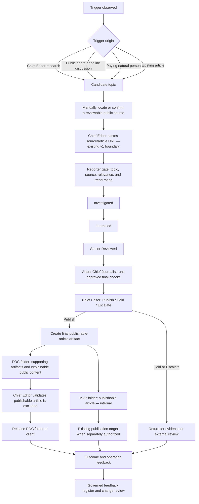
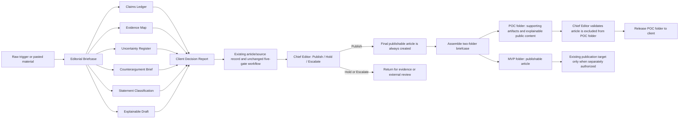

# Board Proposal — Professional Evidence Review PoC as an Operating Validation Lane

**Status:** Draft for Board approval

**Change class:** Business-continuity and operating-validation proposal; planning only

**Build authorization:** None
**Relationship to the governed product:** This proposal does **not** replace, branch, or redefine My-Editorial-App. It preserves the original customer problem, core objects, URL-based application entry point, trend intelligence, five-gate workflow, single Chief Editor operating model, and current Sprint 1. It adds a temporary manual way to find real inputs, serve a small number of paying professionals, and return evidence to the existing governance and development process.

## 1. Clarified prompt

> Prepare a simple Board-approval proposal for a manual **Professional Evidence Review Proof of Concept** that exercises the existing My-Editorial-App design rather than creating a new product. A trigger may originate from the Chief Editor's online research, a public discussion board such as Reddit or Quora, or a natural person who commissions an evidence-aware article. Every trigger is converted manually into the same v1 input: a public article or source URL. At the Reporter gate, the existing design tags the topic, source, relevance, and trend signal; the item then follows the unchanged five-gate editorial workflow. The virtual Chief Journalist assists with the approved deterministic checks, while the human Chief Editor makes the final `Publish/Hold/Escalate` decision, subject to Board oversight for high-liability matters. Every engagement that reaches `Publish` produces the same publishable-article artifact. Store that article only in the internal `MVP` folder; put the supporting briefcase artifacts, including explainable public content, in the client-facing `POC` folder. Before delivery, the Chief Editor verifies that the publishable article is absent from the `POC` folder. Run 5–10 low-liability engagements manually, charge outside the application for the completed outcome, and use the resulting operational and customer evidence to inform—never silently amend—the PRD, Charter, traceability, and development plan. Apply ITIL value co-creation and continual-feedback principles. Do not build or modify governing documents under this proposal.

## 2. Resolution requested

The Board is asked to approve **P0-EVR**, a bounded manual validation lane for the existing My-Editorial-App:

1. Find or receive a topic trigger.
2. Link it to a reviewable public source or article URL.
3. Apply the existing topic, relevance, source, and trend-signal logic.
4. Process it through the existing five editorial gates.
5. Let the Chief Editor publish, hold, or escalate.
6. For every successful `Publish` disposition, create the publishable article and store it in the internal `MVP` folder.
7. Assemble the client-facing `POC` folder from the supporting artifacts, including explainable public content, while excluding the publishable article.
8. Require the Chief Editor to validate the folder separation before the `POC` package is released to the client.
9. Capture live feedback and route it through the existing governance chain before the development team changes anything.

The Board is **not** being asked to approve a second product, new application users, a payment feature, automated web collection, autonomous publication, a schema change, or a replacement Sprint 1.

## 3. Business-continuity framing

The founder's personal stakes and the business's bankruptcy risk are serious, but they are different kinds of fact:

- **Personal survival pressure** explains the urgency. It must not be converted into unsafe publishing, unsupported promises, or unbounded work.
- **Business continuity risk** requires a small cash experiment, limited liability exposure, and evidence before development expenditure.
- **Customer willingness to pay** is a hypothesis. Phrases such as “people would die to pay” must become observable evidence: completed payment, accepted output, reuse, referral, or repeat purchase.
- **Trust and credibility** are not guaranteed brand claims. They are operating properties supported by provenance, counterargument, uncertainty disclosure, corrections, and accountable approval.

The practical response to high stakes is therefore to preserve the product, narrow the trial, charge manually, avoid high-liability work, and learn from real cases before authorizing changes.

## 4. Product invariance — what does not change

| Existing design element | Preserved interpretation | PoC treatment |
|---|---|---|
| Product | AI-Driven Trending Article Tracker | Unchanged |
| Primary application user | One Chief Editor directing virtual agents | Unchanged; commissioning professionals do not receive app accounts |
| Core records | Articles, topics, sources, trend signals, workflow transitions, publication targets | Unchanged |
| Application entry boundary | Chief Editor pastes an article URL | Unchanged; topic-only triggers are resolved to a URL manually before entry |
| Intelligence step | Reporter gate tags topic, source, relevance, and trend signal | Unchanged; the PoC tests whether its judgments are useful |
| Editorial workflow | `Reported → Investigated → Journaled → Senior Reviewed → Chief Approved` | Unchanged |
| Control objective | Every transition is logged; no gate bypass | Unchanged |
| Publication targets | WordPress publish or LinkedIn-ready | Unchanged; successful work still creates the publishable article, while PoC packaging withholds that article from the client |
| Briefcase folders | Not an application feature in v1 | Manual PoC convention: `POC` contains supporting artifacts; `MVP` contains the publishable article |
| v1 account boundary | Single Chief Editor account | Unchanged |
| v1 monetization boundary | No monetization features | Unchanged; manual invoicing/payment is an operating activity, not a product feature |
| Sprint 1 | Existing data-model and sequence-guard work | Unchanged by this proposal |

Any later change to these items requires the normal approval and traceability process. PoC observations alone have no amending authority.

## 5. Trigger-source model

### 5.1 Distinct concepts

| Concept | Meaning | Why the distinction matters |
|---|---|---|
| **Trigger** | An event suggesting that a topic may deserve attention | A trigger is a lead, not yet evidence or an article record |
| **Topic candidate** | The subject the trigger points toward | It may be relevant without being sufficiently sourced |
| **Source material** | A public article, document, standard, post, or other reviewable item | This is what supports or challenges claims |
| **Application intake** | A URL pasted into My-Editorial-App | This remains the v1 system boundary |
| **Commissioning customer** | A natural person who contributes a topic, context, experience, material, feedback, and payment | The customer originates demand but does not become an app user in the PoC |
| **Audience/reader** | The person who may consume the final publication | The reader may differ from both the trigger originator and paying customer |

### 5.2 Permitted manual trigger channels

1. **Chief Editor research:** manual online search, professional publications, standards, blogs, or guest platforms.
2. **Public-discourse signal:** a publicly visible question or discussion on Reddit, Quora, or another public board.
3. **Natural-person commission:** a professional brings a topic, claim, proposal, draft, or source bundle and pays for the reviewed outcome.
4. **Existing-source continuation:** a previously logged article exposes a related or evolving topic.

For the PoC, discovery is manual. Public visibility is not permission for bulk collection, republication, or commercial reuse. The Chief Editor records the URL and enough provenance to reassess rights, privacy, removal, and platform restrictions. No scraper, crawler, account automation, or platform credential is authorized. Reddit's current [User Agreement](https://redditinc.com/policies/user-agreement) restricts unauthorized collection and scraping, and Quora maintains changeable [Platform Policies](https://help.quora.com/hc/en-us/articles/360000470706-Platform-Policies); both therefore belong in the resource register, not in an assumed “public means free to use” rule.

### 5.3 One unchanged workflow



For a topic-only customer request, the manual pre-intake activity finds or confirms the first reviewable URL. This prevents the PoC from quietly changing the application's input model.

## 6. Trend rating and newsworthiness

Trend signals answer: **“Why might this topic matter to this audience now?”** They do not answer: **“Is every claim true, fair, lawful, or safe to publish?”**

The PoC uses the existing design:

- relevance score against the Agile/DevOps/ITIL/AI taxonomy;
- trend indicator such as rising, stable, or declining;
- topic and source tags; and
- the evidence behind the signal.

The Chief Editor records whether the rating correctly represents:

1. audience fit—the buyer asked for apples rather than pears;
2. timeliness;
3. strength and independence of the observed signals; and
4. professional or public usefulness.

A high trend rating never bypasses an editorial gate. A low trend rating does not automatically reject a commissioned or public-interest topic. Trend rating prioritizes attention; later gates determine evidential and editorial readiness. Any confidence-based auto-advance described in older intelligence-layer material remains superseded by the governed no-bypass direction and is not part of this PoC.

## 7. ITIL value co-creation model

ITIL's service-value framing treats value as co-created through collaboration between providers, consumers, and stakeholders while considering outcomes, costs, risks, experience, and sustainability. It does not mean the provider creates value alone or that a customer's ability to DIY eliminates demand.

| Participant | Contribution | Receives or learns |
|---|---|---|
| Commissioning professional | Topic, experience, context, desired outcome, source knowledge, corrections, feedback, and payment | Evidence-aware article, explainable reasoning, reusable template, saved effort, and clearer uncertainty |
| My-Editorial-App service / Chief Editor | Source discovery, trend fit, claim structure, evidence challenge, counterarguments, editorial judgment, phase-gate discipline, and audit record | Revenue, real workflow cases, defect evidence, reusable patterns, and product feedback |
| Virtual agents | Repeatable analysis and checks under approved rules | No independent value claim or decision authority |
| Board and affected stakeholders | Risk boundaries, oversight, and feedback on consequences | Evidence about viability, exposure, and whether development remains justified |

The DIY alternative is a baseline competitor with a price of zero. The paid hypothesis is narrower:

> Some professionals will pay because the combined structure, challenge, accountable judgment, time saving, and reusable output produce more value for them than performing every step alone.

Only completed transactions and observed outcomes can confirm or reject that hypothesis. The official PeopleCert ITIL materials on [value co-creation and continual improvement](https://www.peoplecert.org/browse-certifications/it-governance-and-service-management/ITIL-1/itil-5-foundation-version-50-4154) provide the reference model; the proposal does not claim ITIL certification or endorsement of this service.

## 8. Manual PoC offer

**Working name:** Professional Evidence Review

**Cohort:** 5–10 individually selected professionals in the existing Agile/DevOps/ITIL/AI audience

**Input:** One topic plus at least one discoverable or customer-supplied public source

**Delivery:** The client-facing `POC` folder containing the evidence/reasoning artifacts and explainable public content; the completed publishable article is created but retained in the internal `MVP` folder

**Payment:** Manual, outside the application; price and basic engagement record approved by the Board

**Application access:** Chief Editor only

### 8.1 Standard output

Every engagement that reaches `Publish` produces two deliberately separated folders.

**`POC` folder — client package:**

- topic, intended audience, and trigger provenance;
- trend/relevance assessment;
- structured material claims;
- claim-to-evidence ledger;
- source-quality and relevance review;
- counterarguments and alternative interpretations;
- uncertainty and missing-evidence assessment;
- explainable public content;
- reusable publishing template; and
- Chief Editor `Publish/Hold/Escalate` record.

**`MVP` folder — internal artifact:**

- the final publishable article; and
- the folder-separation/package-validation record.

The two folders carry the same engagement identifier. The publishable article must not be copied, linked, embedded, or exported into the client-facing `POC` folder.

### 8.2 Explicit exclusions

- autonomous publication or unattended approval;
- customer accounts or self-service onboarding;
- in-app payment or subscription features;
- automated Reddit, Quora, search-engine, LinkedIn, or other platform collection;
- personalized legal, medical, investment, or other regulated advice;
- high-liability allegations without a viable external-review route;
- confidential-source or whistleblower publication without safe handling and escalation;
- use of private, deleted, paywalled, or restricted material without appropriate rights;
- promises of guaranteed accuracy, reach, reputation, legal safety, or business results;
- delivery of the My-Editorial-App-created publishable article as part of the PoC client package; and
- any schema, migration, PRD, Charter, architecture, or Sprint 1 change.

## 9. Decision rights and risk control

### 9.1 Authority

| Actor | Authority | Limit |
|---|---|---|
| Chief Editor | Final ordinary `Publish/Hold/Escalate`; owns editorial judgment and judgment-rule versions | Cannot waive Board-defined high-liability escalation or represent public information as legal clearance |
| Board of Directors | Approves PoC, risk appetite, spending boundary, and high-liability envelope; may require hold or escalation | Should not force publication against a Chief Editor hold or force confidential-source disclosure without lawful process and external advice |
| Virtual Chief Journalist | Runs approved deterministic final checks and recommends a disposition | No publication authority, self-modification, or gate-bypass authority |
| Commissioning customer | Contributes requirements and materials and receives the validated `POC` folder | Does not receive the internal publishable article and cannot compel unsupported claims, removal of uncertainty, or bypass of service holds |

For high-liability items, release requires two keys: Chief Editor editorial approval plus Board risk acceptance or an approved external-review outcome. Either may hold or escalate; neither may force release alone.

### 9.2 Simple OD2 fallback

No item is released autonomously. Every item must expose material claims, evidence, counterarguments, and uncertainty and receive Chief Editor review. Any of the following causes an item-level hold or escalation:

- unsupported or circularly sourced material claim;
- source not positioned to know;
- material contradiction unresolved;
- allegation of wrongdoing involving an identifiable person or organization;
- confidential, private, personal, embargoed, or proprietary information;
- regulated-advice interpretation;
- unclear copyright, license, contract, or platform rights;
- unresolved material disagreement between AI output and human review; or
- absent Board/external review for a high-liability matter.

System-wide release pauses only if audit integrity fails, unauthorized publication occurs, customer/source credentials or data are compromised, the active rule version cannot be trusted, a binding authority requires a halt, or a recurring control failure affects multiple engagements.

### 9.3 Public-resource continuity

Public editorial standards, official platform policies, journalist-support organizations, and public mediation/regulator resources may inform a hold or escalation. They are not retained counsel, representation, or legal clearance. Jurisdiction, regulator exposure, applicable contracts, and counsel availability remain recorded as `UNSET` until confirmed. High-liability work remains outside the PoC when that gap matters.

## 10. Live feedback into the existing design

The PoC is valuable because it produces evidence across the **existing** workflow, not because it authorizes immediate feature requests.

### 10.1 Evidence captured per engagement

- trigger channel and topic;
- time required to find/confirm the first reviewable URL;
- relevance and trend rating plus Chief Editor correction;
- time, returns, and evidence defects at each gate;
- hold/escalate reason;
- customer revisions and rejected claims;
- payment completion, price objection, acceptance, publication/reuse, referral, and repeat request;
- correction, complaint, retraction, privacy, source-safety, or platform event; and
- which work was repeatable versus dependent on Chief Editor judgment.

### 10.2 Feedback classification

| Observation type | Route | Authority needed |
|---|---|---|
| Manual wording/checklist improvement | Judgment-rule/SOP log | Chief Editor unless risk envelope changes |
| Defect in an existing requirement or acceptance criterion | Requirements feedback register and traceability impact | Existing document owner/approver |
| New customer-derived product capability | Customer Request → Product Scope proposal | Board/Chief Editor approval before PRD amendment |
| Delivery, tool, test, or operational support need | Project Scope proposal | Approved development planning |
| Change to mission, authority, risk appetite, or the five-gate model | Charter/governance decision | Board ratification before downstream changes |

### 10.3 Governed handoff to development

```text
Engagement evidence
    → Chief Editor feedback register
    → requirement/decision identifier
    → impact review across Charter, PRD, traceability, architecture, data, security, tests, and tasks
    → Board/owner approval where required
    → approved backlog or sprint change
    → development team
```

Authority continues to flow downward. A customer comment, payment, or PoC lesson may initiate a change request, but it cannot silently rewrite the Charter, PRD, or Sprint 1.

## 11. Success, continuation, and stop logic

After 5–10 engagements, the Board receives a short evidence report addressing:

| Question | Evidence |
|---|---|
| Will customers pay despite DIY alternatives? | Completed payments, price objections, repeat requests, and referrals |
| Does the original intake work? | Percentage of triggers that can be resolved to usable URLs without changing the app boundary |
| Does trend rating improve selection? | Chief Editor corrections and customer/audience fit |
| Do the gates improve the output? | Material issues found, returns, holds, corrections, and accepted changes |
| Does folder separation work? | Chief Editor checklist results, packaging defects, near-misses, and unintended article disclosure |
| Is the service operationally survivable? | Active time, elapsed time, rework, external cost, and Chief Editor bottlenecks |
| What should development learn? | Repeated steps, defects, do-not-automate judgments, and traceable change proposals |

The Board then chooses one of four actions:

1. **Continue unchanged** — evidence supports the original plan and manual offer.
2. **Tune operations only** — improve SOP/rules without changing Product Scope.
3. **Approve specific governed changes** — amend only traceable requirements supported by evidence.
4. **Pause or stop** — payment, outcomes, capacity, or risk do not justify continuation.

No vanity metric, expression of enthusiasm, or unpaid interest is sufficient by itself.

## 12. Simple implementation sequence — no build

### Stage 0 — Board decision

- Decide B-P0-01 through B-P0-10 in §13.
- Set the maximum operating spend, price/collection approach, low-liability topic boundary, and review date.
- Confirm that the existing product and Sprint 1 remain unchanged.

### Stage 1 — minimum manual pack

Prepare only:

- one-page engagement/intake record;
- trigger and URL provenance record;
- existing trend/relevance worksheet;
- claim/evidence/counterargument/uncertainty template;
- Chief Editor decision and escalation record;
- manual `POC`/`MVP` folder manifest and exclusion checklist;
- customer feedback/outcome record; and
- consolidated feedback register with requirement/decision links.

### Stage 2 — 5–10 engagements

- Select a narrow cohort from the existing professional audience.
- Work one engagement at a time.
- Accept only topics inside the agreed low-liability boundary.
- Use the unchanged URL intake and gate sequence.
- Charge manually and record the actual outcome.
- On `Publish`, create the final publishable article, store it in `MVP`, assemble `POC` from the supporting artifacts, and have the Chief Editor validate the exclusion before client delivery.
- Do not automate discovery, payment, publication, or approval.

### Stage 3 — weekly Chief Editor review

- Correct trend and judgment rules from observed cases.
- Separate an SOP improvement from a Product Scope request.
- Hold any high-liability or source-safety item without a viable escalation route.
- Give the Board a concise exception report rather than raw operational noise.

### Stage 4 — evidence handoff

- Present the 5–10-engagement evidence report.
- Route approved change requests through the governed document hierarchy.
- Give the development team only approved, traceable changes.
- Continue the original Sprint 1 unless the Board separately approves an amendment.

## 13. Board approval form

The Board should record `Approve`, `Reject`, or `Amend` for each item:

| ID | Decision requested | Status |
|---|---|---|
| B-P0-01 | Approve P0-EVR as a manual operating-validation lane for the existing My-Editorial-App, not a product pivot | Pending |
| B-P0-02 | Confirm the original product, core objects, URL intake, five gates, v1 boundaries, and Sprint 1 remain unchanged | Pending |
| B-P0-03 | Approve Chief Editor research, public-board signals, natural-person commissions, and existing articles as manual trigger channels | Pending |
| B-P0-04 | Require every topic-only trigger to resolve to a reviewable URL before entering the existing application boundary | Pending |
| B-P0-05 | Approve trend rating as prioritization/newsworthiness evidence that never bypasses editorial gates | Pending |
| B-P0-06 | Approve 5–10 manually delivered, off-platform paid engagements with no customer-account or payment-feature build | Pending |
| B-P0-07 | Approve the ITIL-informed value co-creation hypothesis and the payment/outcome evidence used to test it | Pending |
| B-P0-08 | Approve Chief Editor authority, virtual Chief Journalist limits, two-key high-liability release, and the simple OD2 fallback | Pending |
| B-P0-09 | Approve the live-feedback register and governed handoff from engagement evidence to approved development changes | Pending |
| B-P0-10 | Confirm this proposal authorizes no code, schema, migration, automated collection, autonomous publication, or governing-document change | Pending |

Approval evidence must identify the approver, date, conditions, dissent, spending/risk boundaries, and review date. Silence is not approval.

## 14. Guaranteed failure modes

| Failure mode | Category confusion | Prevention |
|---|---|---|
| Describe the PoC as a replacement product | Service-validation lane versus Product Scope | Preserve the invariants in §4 and require a separate approved change request |
| Put topic-only requests directly into the app | Pre-intake trigger versus v1 URL boundary | Manually resolve each trigger to a reviewable URL |
| Treat a public post as free commercial material | Public visibility versus rights and platform permission | Record provenance, use only what is necessary, review policies, and do not automate collection |
| Assume DIY means nobody pays—or enthusiasm means they will | Capability versus experienced value | Test completed payment, use, referral, and repeat demand |
| Use ITIL as a sales badge | Reference framework versus endorsement | Apply co-creation and feedback mechanisms without claiming certification or guaranteed value |
| Let trend popularity imply truth or safety | Newsworthiness versus verification/liability | Keep trend rating at triage and run every gate |
| Turn customer feedback directly into developer tasks | Demand signal versus approved requirement | Use the governed feedback and traceability route |
| Build accounts or payments to test demand | Selling the service versus monetization software | Charge outside the app during the PoC |
| Advertise a finished article and then withhold it | Sales promise versus actual client entitlement | Disclose the `POC` package and article exclusion before payment |
| Treat placement in `MVP` as permission to publish client-derived material | Artifact custody versus copyright, license, consent, and publication authority | Record rights and obtain separate publication authorization |
| Let Board pressure or cash pressure force publication | Institutional survival versus editorial evidence | Two-key high-liability release; either authority may hold |
| Treat virtual-agent confidence as approval | Analysis mechanism versus accountable judgment | Chief Editor remains final human decision-maker |

## 15. Preservation layer

Future revisions must preserve these distinctions:

- original product versus manual validation lane;
- trigger originator versus application user;
- topic trigger versus reviewable source versus URL intake;
- commissioning customer versus reader/audience;
- manual payment versus monetization feature;
- customer participation versus provider accountability in value co-creation;
- trend/newsworthiness versus truth, fairness, and legal safety;
- virtual-agent recommendation versus Chief Editor authority;
- Chief Editor editorial judgment versus Board risk oversight;
- raw feedback versus approved requirement change;
- human survival pressure versus institutional evidence and controls; and
- public information versus permission, counsel, or clearance.

## 16. Editorial Briefcase addendum

Sections 1–15 remain in force without deletion or replacement. This addendum layers a small set of inspectable work artifacts onto the manual PoC so that the work performed before publication can be reviewed, handed over, and improved.

### 16.1 Clarified prompt for this addendum

> Preserve every existing section of the Board proposal. Add an **Editorial Briefcase** as the manual PoC work package linked to the existing source/article workflow. The briefcase may begin from pasted article text, a LinkedIn post, a claim, a source, an idea, or a professional observation. It must produce six inspectable artifacts—Claims, Evidence, Uncertainty, Counterargument, Classification, and Explainable Draft—and a four-part client report: What we know, What we think, What we do not know, and Why we reached this conclusion. Treat the five deeper business layers—Evidence, Reasoning, Decision, Execution, and Publishing—as judgment-rule observability categories, not as permission to build a large platform. Run the same workflow for both product modes and always create the final publishable article when the Chief Editor assigns the successful status `Publish`. Maintain two sibling folders inside the briefcase: the client-facing `POC` folder contains all supporting artifacts, including explainable public content; the internal `MVP` folder contains the publishable article. Before client delivery, the Chief Editor must validate that the publishable article is not present, linked, or embedded in the `POC` folder. Do not build, change the schema, or amend governing documents under this addendum.

### 16.2 Confirmed artifact and delivery boundary

The clarified operating rule is:

> Both POC and MVP use the same complete editorial workflow. A successful `Publish` decision always creates the publishable-article artifact. The difference is not workflow completion or article creation; it is which folder is delivered. The internal `MVP` folder contains the publishable article. The client-facing `POC` folder contains every approved supporting artifact used to create it, including explainable public content, but excludes the publishable article itself.

Before `Publish`, any article text remains a publication candidate. A `Hold` or `Escalate` disposition does not falsely label that candidate publishable and does not complete the two-folder delivery package.

The client may use the `POC` artifacts in their own process to create a separate article. That possible later use does not transfer the My-Editorial-App-created publishable article or bypass the Chief Editor's package check.

For PoC operations, `Publish` means the article has met the editorial success criteria and the final artifact is created. It does not by itself authorize an external platform action. Any WordPress, LinkedIn-ready, licensing, reuse, or other publication action involving client-derived material requires a separately recorded authorization.

### 16.3 Two-folder briefcase convention

For the manual PoC, every engagement briefcase has two sibling folders:

```text
Editorial-Briefcase-{engagement-id}/
├── POC/    # client-facing supporting artifacts; no publishable article
└── MVP/    # internal publishable article and validation record
```

These are operating labels, not repository folders, application routes, database tables, or authorization to implement storage. To avoid accidental disclosure, the Chief Editor shares only the `POC` folder—never the briefcase root—and records the completed separation check.

Before payment, the engagement record must state plainly that the client receives the `POC` folder and does not receive the My-Editorial-App-created publishable article. Folder placement does not decide copyright, license, or ownership. Those rights and any permission to reuse or publish client-derived material must be recorded separately; without that permission, the `MVP` article remains an internal validation artifact.

## 17. The brutally small Editorial Briefcase MVP

The briefcase is a bounded work package, not a second publishing platform. During the PoC it may be maintained manually. This section defines the information and decision artifacts, not a database schema or build backlog.

### 17.1 Input Card

The Chief Editor may paste or record one primary input:

- article;
- LinkedIn post;
- claim;
- source;
- idea; or
- professional observation.

The Input Card also records:

- input type;
- originator and trigger channel;
- original URL, document reference, or `UNANCHORED` status;
- date observed;
- intended audience and desired outcome;
- relevant rights, privacy, confidentiality, and conflict flags; and
- the Chief Editor responsible for intake.

A claim, idea, or professional observation may begin as `UNANCHORED`, but it cannot silently become fact or enter the existing publication path. The Chief Editor must locate or receive reviewable sources and satisfy the existing URL-intake rule before the house-publication workflow proceeds.

### 17.2 Processing artifacts

#### Artifact 1 — Claims Ledger

**Question:** What factual or material claims are being made?

Record each material claim separately, with an identifier, exact or normalized wording, origin, affected person or organization, and current status. Compound claims are split so that one supported clause does not hide an unsupported clause.

#### Artifact 2 — Evidence Map

**Question:** What evidence supports or contradicts each claim?

Link every claim to its sources, source position, relevance, independence, recency, rights restrictions, and support/contradiction relationship. An unlinked claim remains unsupported regardless of how plausible it sounds.

#### Artifact 3 — Uncertainty Register

**Question:** What cannot currently be established?

Record missing evidence, unresolved contradictions, ambiguous terms, unavailable participants, timing limits, confidence boundaries, and what evidence would change the assessment. Absence of evidence is not automatically evidence of absence.

#### Artifact 4 — Counterargument Brief

**Question:** What is the strongest reasonable objection or alternative account?

State the strongest good-faith counterargument, the evidence it relies on, how the draft responds, and what remains unresolved. A weak “straw person” objection does not satisfy this artifact.

#### Artifact 5 — Statement Classification

**Question:** What kind of statement is each material sentence?

Classify and visibly distinguish:

- **Fact** — externally verifiable and supported to the stated level;
- **Interpretation** — meaning inferred from facts using an explicit frame;
- **Opinion** — a value judgment or preference attributable to a person;
- **Prediction** — a forward-looking claim dependent on assumptions.

Mixed statements are decomposed. Classification does not prove correctness; it controls how strongly a statement may be written.

#### Artifact 6 — Explainable Draft

**Question:** How can the current assessment be communicated without hiding its basis or uncertainty?

Generate a plain-language draft that links material conclusions to the Claims Ledger, Evidence Map, Uncertainty Register, Counterargument Brief, and Statement Classification. This explainable public content belongs in the `POC` folder. It is then used by the same editorial workflow to create the separate publishable-article artifact stored in the `MVP` folder after Chief Editor approval.

### 17.3 Client Decision Report

The briefcase produces one short report with four required sections:

1. **What we know** — supported facts and their sources.
2. **What we think** — interpretations, opinions, and the frame used.
3. **What we do not know** — unresolved uncertainty and missing evidence.
4. **Why we reached this conclusion** — the evidence, counterargument, judgment rules, and accountable decision basis.

The fourth section records a concise decision rationale. It does not expose private model chain-of-thought. Inspectability comes from sources, rule versions, classifications, reason codes, exceptions, and human decisions.

## 18. Briefcase as work in the existing system

### 18.1 Relationship model



The briefcase is the **work package**; the Article remains the existing publication object. Both POC and MVP traverse the same gates and create the same final article upon `Publish`. Folder separation controls entitlement and delivery, not editorial processing. In a future approved build, an Article could reference its briefcase, but this proposal does not decide cardinality, storage, migrations, or user interface.

### 18.2 Gate-to-artifact view

| Existing editorial point | Briefcase evidence available to the reviewer | Authority remains |
|---|---|---|
| Intake / Reporter | Input Card, provenance, topic, source, relevance, trend signal | Existing Reporter/Chief Editor arrangement |
| Investigator | Claims Ledger and Evidence Map | Existing investigation gate |
| Journalist | Uncertainty Register, Counterargument Brief, Statement Classification, Explainable Draft | Existing journalism gate |
| Senior Reviewed | Challenge completeness, contradictions, classifications, and unresolved risk | Existing human-review direction |
| Virtual Chief Journalist check | Completeness and approved deterministic-rule results | Recommendation only |
| Chief Editor decision | Entire briefcase, exceptions, overrides, decision rationale, and publication candidate | Final `Publish/Hold/Escalate` authority subject to approved high-liability controls |
| Package validation after `Publish` | `POC` manifest and `MVP` publishable article | Chief Editor verifies the publishable article is excluded from the client package |

This is a review lens, not permission to rename gates or introduce new workflow states.

## 19. Difference between the existing MVP and the Briefcase PoC

| Dimension | Existing My-Editorial-App MVP | Editorial Briefcase PoC |
|---|---|---|
| Primary job | Move sourced work through editorial gates to a publication-ready outcome | Exercise the same workflow while selling the supporting evidence-and-reasoning package |
| Accepted starting material | URL/article intake under the existing design | Article, LinkedIn post, claim, source, idea, or professional observation |
| Core work object | Article with workflow state and publication target | Same article workflow, supported by a briefcase of linked judgment artifacts |
| Workflow endpoint | Chief Editor `Publish/Hold/Escalate` | Same Chief Editor `Publish/Hold/Escalate` |
| Article creation | A final publishable article is created on `Publish` | The same final publishable article is created on `Publish` |
| Package structure | Internal `MVP` folder contains the publishable article | Client-facing `POC` folder contains supporting artifacts; internal `MVP` folder contains the publishable article |
| Client entitlement | Not defined as a PoC client package | Client receives `POC` only; the My-Editorial-App-created publishable article is excluded |
| Platform endpoint | WordPress publish or LinkedIn-ready when authorized | No PoC client publication action; the internal article remains available only to the separately authorized MVP route |
| Client's later use | Not applicable to the MVP output | Client may use the `POC` artifacts to create a separate article through their own process |
| Account boundary | Single Chief Editor | Still single Chief Editor; the client receives a deliverable, not an account |
| Payment | No in-application monetization feature | Manual payment for the service outcome |
| Shared purpose | Evidence-aware, controlled public knowledge | Improve the evidence and reasoning available before publication |

The two are complementary:

- the **Briefcase PoC** makes judgment observable and delivers the supporting `POC` folder; and
- the **existing MVP** retains the completed publishable article in the internal `MVP` folder and governs any later platform route.

The workflow and successful article creation are the same; the delivered entitlement is different. The Chief Editor must not present the supporting `POC` artifacts as the withheld publishable article or accidentally include that article in the client package.

## 20. Deeper business architecture as observable artifacts

The long-term architecture remains:

```text
Evidence → Intelligence → Decision → Action → Learning → Publication
     ▲                                                        │
     └──────────────────── measured feedback ─────────────────┘
```

For the Editorial Briefcase, the five business layers are represented by inspectable artifacts:

| Layer | Purpose | Briefcase artifacts | Observable judgment record |
|---|---|---|---|
| **1. Evidence** | Establish the source basis | Input Card, source records, Claims Ledger, Evidence Map | Provenance, source-to-claim links, support/contradiction, rights flags |
| **2. Reasoning** | Test meaning and alternatives | Uncertainty Register, Counterargument Brief, Statement Classification | Assumptions, ambiguity, alternatives, unresolved contradictions, rule version |
| **3. Decision** | State what follows and why | Client Decision Report, Chief Editor disposition | Conclusion, reason codes, dissent, exception, reviewer, date |
| **4. Execution** | Define what happens next and learn from it | Evidence requests, correction tasks, client actions, feedback record | Owner, status, due/review point, result, change signal |
| **5. Publishing** | Convert approved knowledge into public communication | Explainable Draft in `POC`; final publishable article in `MVP` after `Publish` | Version, audience, approvals, folder entitlement, publication target, correction/retraction linkage |

These artifacts make the editorial system observable without pretending that every judgment can be reduced to a score or exposing raw private reasoning. For each material decision, the system should eventually be able to show:

- which inputs and sources were used;
- which approved judgment-rule version ran;
- which classifications and uncertainty flags resulted;
- what the virtual agent recommended;
- what the Chief Editor decided and why;
- what changed after feedback; and
- which artifact version supported any publication.

During the manual PoC, a simple versioned folder or document pack is sufficient. The five-layer model is an architectural horizon, not authority to build a giant publishing platform.

## 21. Briefcase-specific implementation plan — no build

### Phase EB-0 — Board addendum approval

- Decide B-P0-11 through B-P0-16 in §22.
- Confirm that §§1–15 remain approved or pending on their own terms.
- Confirm that the briefcase is a manual artifact pack during the PoC.
- Confirm that both product modes use the same workflow and always create the final article on `Publish`.
- Confirm that the `POC` and `MVP` folders create a delivery boundary, not two editorial workflows.

### Phase EB-1 — manual artifact templates

After Board approval, prepare one lightweight template for each artifact:

1. Input Card;
2. Claims Ledger;
3. Evidence Map;
4. Uncertainty Register;
5. Counterargument Brief;
6. Statement Classification;
7. Explainable Draft;
8. Client Decision Report; and
9. Chief Editor disposition and feedback record;
10. publication-candidate/final-article record; and
11. two-folder manifest and exclusion-validation checklist.

Use consistent engagement, claim, source, artifact-version, and decision identifiers. This is document preparation, not application development.

### Phase EB-2 — run inside the existing manual PoC

- Create one briefcase per engagement.
- Link the briefcase to the trigger and any existing article/source URL.
- Complete the six processing artifacts before delivery.
- Record `UNANCHORED`, unsupported, uncertain, or disputed material explicitly.
- Apply Chief Editor review and the existing hold/escalation rules.
- Create the final publishable article whenever the Chief Editor assigns `Publish`.
- Place that article only in the internal `MVP` folder.
- Place the Client Decision Report and agreed supporting artifacts, including explainable public content, in the `POC` folder.
- Have the Chief Editor inspect the `POC` manifest and exported package, then record that the publishable article is absent.
- Share only the `POC` folder with the client; never share the briefcase root or `MVP` folder.

### Phase EB-3 — observe the artifacts

For each artifact record:

- time to complete;
- revisions and returns;
- missing or duplicated information;
- Chief Editor correction;
- client usefulness and reuse;
- packaging errors or near-misses involving the withheld article;
- risk or misunderstanding caused;
- whether the artifact affected the final decision; and
- whether the step is repeatable or judgment-dependent.

### Phase EB-4 — decide whether anything deserves software

After 5–10 cases, propose only the smallest repeated artifact operations that reduce effort without weakening accountability. A later build proposal must separately define Product Scope, data model, access, privacy, security, acceptance tests, migration impact, and relationship to the existing Article workflow.

No artifact becomes a feature merely because it appears in this addendum.

## 22. Board approval addendum

| ID | Decision requested | Status |
|---|---|---|
| B-P0-11 | Approve the Editorial Briefcase as the manual PoC work package while retaining §§1–15 | Pending |
| B-P0-12 | Approve the six input types and require provenance plus `UNANCHORED` handling | Pending |
| B-P0-13 | Approve Claims, Evidence, Uncertainty, Counterargument, Classification, Explainable Draft, and Client Decision Report as the minimum artifact set | Pending |
| B-P0-14 | Confirm that a successful `Publish` always creates the publishable article, stores it in `MVP`, excludes it from client-facing `POC`, and requires pre-payment disclosure plus separate external-publication authorization | Pending |
| B-P0-15 | Approve the five business layers as observability categories with concise rationale—not private model chain-of-thought | Pending |
| B-P0-16 | Confirm this addendum authorizes manual templates and observation only, with no code, schema, workflow-state, account, payment, or publication change | Pending |

## 23. Briefcase acceptance checklist

A manual briefcase is complete only when:

- one Input Card identifies the trigger, input type, origin, intended audience, and provenance status;
- every material claim has a stable identifier and classification;
- every factual claim is linked to evidence or marked unsupported;
- contradictory evidence is visible;
- unresolved uncertainty is explicit;
- the strongest reasonable counterargument is represented fairly;
- Fact, Interpretation, Opinion, and Prediction are distinguishable;
- the Explainable Draft can be traced to the artifacts;
- the Client Decision Report answers all four required questions;
- the judgment-rule version, virtual-agent recommendation, Chief Editor decision, exceptions, and date are recorded;
- the final publishable article exists in `MVP` for every successful `Publish` disposition;
- the `POC` folder contains all approved supporting artifacts, including explainable public content;
- the client acknowledged before payment that the publishable article is excluded from their package;
- the Chief Editor has validated that no copy, link, embedding, or export of the publishable article exists in `POC`;
- rights and external-publication authorization are recorded separately from folder placement;
- only the `POC` folder is released to the client; and
- the two folders carry the same engagement identifier and remain traceable to the same workflow.

## 24. Briefcase preservation layer

Future revisions must preserve:

- one editorial workflow versus two delivery folders;
- work package versus publication object;
- explainable public content in `POC` versus publishable news article in `MVP`;
- creation of the publishable article versus entitlement to receive it;
- editorial `Publish` status versus authorization to execute an external publication action;
- evidence trace versus a claim of truth;
- concise decision rationale versus private chain-of-thought;
- statement classification versus evidential sufficiency;
- professional observation versus verified fact;
- `POC` client delivery versus `MVP` retention and any separately authorized platform publication;
- folder custody versus ownership, license, consent, and publication rights;
- client use of supporting artifacts versus ownership or receipt of the withheld My-Editorial-App-created article;
- artifact observability versus automated decision authority;
- the five-layer horizon versus present PoC scope; and
- manual learning evidence versus build authorization.
