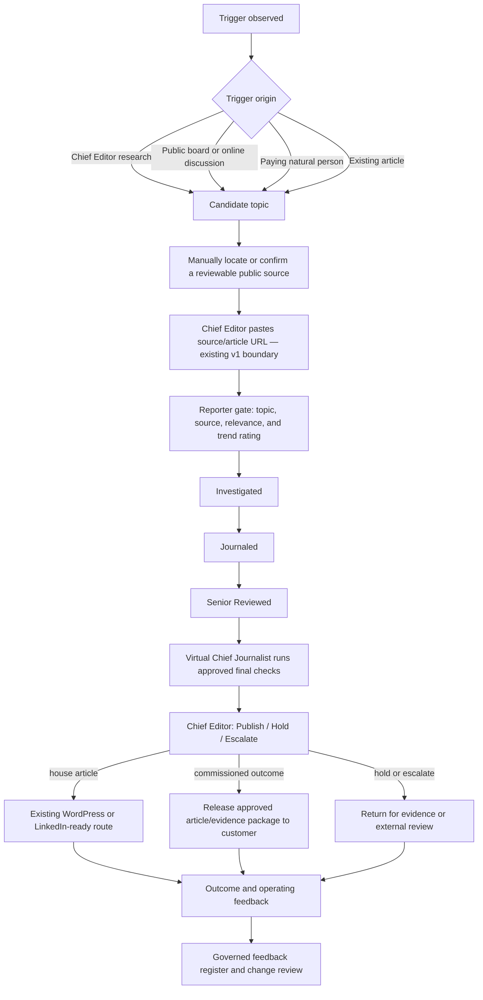

# Board Proposal — Professional Evidence Review PoC as an Operating Validation Lane

**Status:** Draft for Board approval

**Change class:** Business-continuity and operating-validation proposal; planning only

**Build authorization:** None
**Relationship to the governed product:** This proposal does **not** replace, branch, or redefine My-Editorial-App. It preserves the original customer problem, core objects, URL-based application entry point, trend intelligence, five-gate workflow, single Chief Editor operating model, and current Sprint 1. It adds a temporary manual way to find real inputs, serve a small number of paying professionals, and return evidence to the existing governance and development process.

## 1. Clarified prompt

> Prepare a simple Board-approval proposal for a manual **Professional Evidence Review Proof of Concept** that exercises the existing My-Editorial-App design rather than creating a new product. A trigger may originate from the Chief Editor's online research, a public discussion board such as Reddit or Quora, or a natural person who commissions an evidence-aware article. Every trigger is converted manually into the same v1 input: a public article or source URL. At the Reporter gate, the existing design tags the topic, source, relevance, and trend signal; the item then follows the unchanged five-gate editorial workflow. The virtual Chief Journalist assists with the approved deterministic checks, while the human Chief Editor makes the final `Publish/Hold/Escalate` decision, subject to Board oversight for high-liability matters. Run 5–10 low-liability engagements manually, charge outside the application for the completed outcome, and use the resulting operational and customer evidence to inform—never silently amend—the PRD, Charter, traceability, and development plan. Apply ITIL value co-creation and continual-feedback principles. Do not build or modify governing documents under this proposal.

## 2. Resolution requested

The Board is asked to approve **P0-EVR**, a bounded manual validation lane for the existing My-Editorial-App:

1. Find or receive a topic trigger.
2. Link it to a reviewable public source or article URL.
3. Apply the existing topic, relevance, source, and trend-signal logic.
4. Process it through the existing five editorial gates.
5. Let the Chief Editor publish, hold, or escalate.
6. Deliver the resulting article or evidence package through the appropriate route.
7. Capture live feedback and route it through the existing governance chain before the development team changes anything.

The Board is **not** being asked to approve a second product, new application users, a payment feature, automated web collection, autonomous publication, a schema change, or a replacement Sprint 1.

## 3. Business-continuity framing

The founder's personal stakes and the business's bankruptcy risk are serious, but they are different kinds of fact:

- **Personal survival pressure** explains the urgency. It must not be converted into unsafe publishing, unsupported promises, or unbounded work.
- **Business continuity risk** requires a small cash experiment, limited liability exposure, and evidence before development expenditure.
- **Customer willingness to pay** is a hypothesis. Phrases such as “people would die to pay” must become observable evidence: completed payment, accepted output, reuse, referral, or repeat purchase.
- **Trust and credibility** are not guaranteed brand claims. They are operating properties supported by provenance, counterargument, uncertainty disclosure, corrections, and accountable approval.

The practical response to high stakes is therefore to preserve the product, narrow the trial, charge manually, avoid high-liability work, and learn from real cases before authorizing changes.

## 4. Product invariance — what does not change

| Existing design element | Preserved interpretation | PoC treatment |
|---|---|---|
| Product | AI-Driven Trending Article Tracker | Unchanged |
| Primary application user | One Chief Editor directing virtual agents | Unchanged; commissioning professionals do not receive app accounts |
| Core records | Articles, topics, sources, trend signals, workflow transitions, publication targets | Unchanged |
| Application entry boundary | Chief Editor pastes an article URL | Unchanged; topic-only triggers are resolved to a URL manually before entry |
| Intelligence step | Reporter gate tags topic, source, relevance, and trend signal | Unchanged; the PoC tests whether its judgments are useful |
| Editorial workflow | `Reported → Investigated → Journaled → Senior Reviewed → Chief Approved` | Unchanged |
| Control objective | Every transition is logged; no gate bypass | Unchanged |
| Publication targets | WordPress publish or LinkedIn-ready | Unchanged for house publishing; a commissioned package may instead be handed to the customer during the manual PoC |
| v1 account boundary | Single Chief Editor account | Unchanged |
| v1 monetization boundary | No monetization features | Unchanged; manual invoicing/payment is an operating activity, not a product feature |
| Sprint 1 | Existing data-model and sequence-guard work | Unchanged by this proposal |

Any later change to these items requires the normal approval and traceability process. PoC observations alone have no amending authority.

## 5. Trigger-source model

### 5.1 Distinct concepts

| Concept | Meaning | Why the distinction matters |
|---|---|---|
| **Trigger** | An event suggesting that a topic may deserve attention | A trigger is a lead, not yet evidence or an article record |
| **Topic candidate** | The subject the trigger points toward | It may be relevant without being sufficiently sourced |
| **Source material** | A public article, document, standard, post, or other reviewable item | This is what supports or challenges claims |
| **Application intake** | A URL pasted into My-Editorial-App | This remains the v1 system boundary |
| **Commissioning customer** | A natural person who contributes a topic, context, experience, material, feedback, and payment | The customer originates demand but does not become an app user in the PoC |
| **Audience/reader** | The person who may consume the final publication | The reader may differ from both the trigger originator and paying customer |

### 5.2 Permitted manual trigger channels

1. **Chief Editor research:** manual online search, professional publications, standards, blogs, or guest platforms.
2. **Public-discourse signal:** a publicly visible question or discussion on Reddit, Quora, or another public board.
3. **Natural-person commission:** a professional brings a topic, claim, proposal, draft, or source bundle and pays for the reviewed outcome.
4. **Existing-source continuation:** a previously logged article exposes a related or evolving topic.

For the PoC, discovery is manual. Public visibility is not permission for bulk collection, republication, or commercial reuse. The Chief Editor records the URL and enough provenance to reassess rights, privacy, removal, and platform restrictions. No scraper, crawler, account automation, or platform credential is authorized. Reddit's current [User Agreement](https://redditinc.com/policies/user-agreement) restricts unauthorized collection and scraping, and Quora maintains changeable [Platform Policies](https://help.quora.com/hc/en-us/articles/360000470706-Platform-Policies); both therefore belong in the resource register, not in an assumed “public means free to use” rule.

### 5.3 One unchanged workflow



For a topic-only customer request, the manual pre-intake activity finds or confirms the first reviewable URL. This prevents the PoC from quietly changing the application's input model.

## 6. Trend rating and newsworthiness

Trend signals answer: **“Why might this topic matter to this audience now?”** They do not answer: **“Is every claim true, fair, lawful, or safe to publish?”**

The PoC uses the existing design:

- relevance score against the Agile/DevOps/ITIL/AI taxonomy;
- trend indicator such as rising, stable, or declining;
- topic and source tags; and
- the evidence behind the signal.

The Chief Editor records whether the rating correctly represents:

1. audience fit—the buyer asked for apples rather than pears;
2. timeliness;
3. strength and independence of the observed signals; and
4. professional or public usefulness.

A high trend rating never bypasses an editorial gate. A low trend rating does not automatically reject a commissioned or public-interest topic. Trend rating prioritizes attention; later gates determine evidential and editorial readiness. Any confidence-based auto-advance described in older intelligence-layer material remains superseded by the governed no-bypass direction and is not part of this PoC.

## 7. ITIL value co-creation model

ITIL's service-value framing treats value as co-created through collaboration between providers, consumers, and stakeholders while considering outcomes, costs, risks, experience, and sustainability. It does not mean the provider creates value alone or that a customer's ability to DIY eliminates demand.

| Participant | Contribution | Receives or learns |
|---|---|---|
| Commissioning professional | Topic, experience, context, desired outcome, source knowledge, corrections, feedback, and payment | Evidence-aware article, explainable reasoning, reusable template, saved effort, and clearer uncertainty |
| My-Editorial-App service / Chief Editor | Source discovery, trend fit, claim structure, evidence challenge, counterarguments, editorial judgment, phase-gate discipline, and audit record | Revenue, real workflow cases, defect evidence, reusable patterns, and product feedback |
| Virtual agents | Repeatable analysis and checks under approved rules | No independent value claim or decision authority |
| Board and affected stakeholders | Risk boundaries, oversight, and feedback on consequences | Evidence about viability, exposure, and whether development remains justified |

The DIY alternative is a baseline competitor with a price of zero. The paid hypothesis is narrower:

> Some professionals will pay because the combined structure, challenge, accountable judgment, time saving, and reusable output produce more value for them than performing every step alone.

Only completed transactions and observed outcomes can confirm or reject that hypothesis. The official PeopleCert ITIL materials on [value co-creation and continual improvement](https://www.peoplecert.org/browse-certifications/it-governance-and-service-management/ITIL-1/itil-5-foundation-version-50-4154) provide the reference model; the proposal does not claim ITIL certification or endorsement of this service.

## 8. Manual PoC offer

**Working name:** Professional Evidence Review

**Cohort:** 5–10 individually selected professionals in the existing Agile/DevOps/ITIL/AI audience

**Input:** One topic plus at least one discoverable or customer-supplied public source

**Delivery:** One completed article or evidence-review package

**Payment:** Manual, outside the application; price and basic engagement record approved by the Board
**Application access:** Chief Editor only

### 8.1 Standard output

- topic, intended audience, and trigger provenance;
- trend/relevance assessment;
- structured material claims;
- claim-to-evidence ledger;
- source-quality and relevance review;
- counterarguments and alternative interpretations;
- uncertainty and missing-evidence assessment;
- explainable final article;
- reusable publishing template; and
- Chief Editor `Publish/Hold/Escalate` record.

### 8.2 Explicit exclusions

- autonomous publication or unattended approval;
- customer accounts or self-service onboarding;
- in-app payment or subscription features;
- automated Reddit, Quora, search-engine, LinkedIn, or other platform collection;
- personalized legal, medical, investment, or other regulated advice;
- high-liability allegations without a viable external-review route;
- confidential-source or whistleblower publication without safe handling and escalation;
- use of private, deleted, paywalled, or restricted material without appropriate rights;
- promises of guaranteed accuracy, reach, reputation, legal safety, or business results; and
- any schema, migration, PRD, Charter, architecture, or Sprint 1 change.

## 9. Decision rights and risk control

### 9.1 Authority

| Actor | Authority | Limit |
|---|---|---|
| Chief Editor | Final ordinary `Publish/Hold/Escalate`; owns editorial judgment and judgment-rule versions | Cannot waive Board-defined high-liability escalation or represent public information as legal clearance |
| Board of Directors | Approves PoC, risk appetite, spending boundary, and high-liability envelope; may require hold or escalation | Should not force publication against a Chief Editor hold or force confidential-source disclosure without lawful process and external advice |
| Virtual Chief Journalist | Runs approved deterministic final checks and recommends a disposition | No publication authority, self-modification, or gate-bypass authority |
| Commissioning customer | Contributes requirements and materials, reviews delivery, and chooses whether to use the commissioned output externally | Cannot compel unsupported claims, removal of uncertainty, or bypass of service holds |

For high-liability items, release requires two keys: Chief Editor editorial approval plus Board risk acceptance or an approved external-review outcome. Either may hold or escalate; neither may force release alone.

### 9.2 Simple OD2 fallback

No item is released autonomously. Every item must expose material claims, evidence, counterarguments, and uncertainty and receive Chief Editor review. Any of the following causes an item-level hold or escalation:

- unsupported or circularly sourced material claim;
- source not positioned to know;
- material contradiction unresolved;
- allegation of wrongdoing involving an identifiable person or organization;
- confidential, private, personal, embargoed, or proprietary information;
- regulated-advice interpretation;
- unclear copyright, license, contract, or platform rights;
- unresolved material disagreement between AI output and human review; or
- absent Board/external review for a high-liability matter.

System-wide release pauses only if audit integrity fails, unauthorized publication occurs, customer/source credentials or data are compromised, the active rule version cannot be trusted, a binding authority requires a halt, or a recurring control failure affects multiple engagements.

### 9.3 Public-resource continuity

Public editorial standards, official platform policies, journalist-support organizations, and public mediation/regulator resources may inform a hold or escalation. They are not retained counsel, representation, or legal clearance. Jurisdiction, regulator exposure, applicable contracts, and counsel availability remain recorded as `UNSET` until confirmed. High-liability work remains outside the PoC when that gap matters.

## 10. Live feedback into the existing design

The PoC is valuable because it produces evidence across the **existing** workflow, not because it authorizes immediate feature requests.

### 10.1 Evidence captured per engagement

- trigger channel and topic;
- time required to find/confirm the first reviewable URL;
- relevance and trend rating plus Chief Editor correction;
- time, returns, and evidence defects at each gate;
- hold/escalate reason;
- customer revisions and rejected claims;
- payment completion, price objection, acceptance, publication/reuse, referral, and repeat request;
- correction, complaint, retraction, privacy, source-safety, or platform event; and
- which work was repeatable versus dependent on Chief Editor judgment.

### 10.2 Feedback classification

| Observation type | Route | Authority needed |
|---|---|---|
| Manual wording/checklist improvement | Judgment-rule/SOP log | Chief Editor unless risk envelope changes |
| Defect in an existing requirement or acceptance criterion | Requirements feedback register and traceability impact | Existing document owner/approver |
| New customer-derived product capability | Customer Request → Product Scope proposal | Board/Chief Editor approval before PRD amendment |
| Delivery, tool, test, or operational support need | Project Scope proposal | Approved development planning |
| Change to mission, authority, risk appetite, or the five-gate model | Charter/governance decision | Board ratification before downstream changes |

### 10.3 Governed handoff to development

```text
Engagement evidence
    → Chief Editor feedback register
    → requirement/decision identifier
    → impact review across Charter, PRD, traceability, architecture, data, security, tests, and tasks
    → Board/owner approval where required
    → approved backlog or sprint change
    → development team
```

Authority continues to flow downward. A customer comment, payment, or PoC lesson may initiate a change request, but it cannot silently rewrite the Charter, PRD, or Sprint 1.

## 11. Success, continuation, and stop logic

After 5–10 engagements, the Board receives a short evidence report addressing:

| Question | Evidence |
|---|---|
| Will customers pay despite DIY alternatives? | Completed payments, price objections, repeat requests, and referrals |
| Does the original intake work? | Percentage of triggers that can be resolved to usable URLs without changing the app boundary |
| Does trend rating improve selection? | Chief Editor corrections and customer/audience fit |
| Do the gates improve the output? | Material issues found, returns, holds, corrections, and accepted changes |
| Is the service operationally survivable? | Active time, elapsed time, rework, external cost, and Chief Editor bottlenecks |
| What should development learn? | Repeated steps, defects, do-not-automate judgments, and traceable change proposals |

The Board then chooses one of four actions:

1. **Continue unchanged** — evidence supports the original plan and manual offer.
2. **Tune operations only** — improve SOP/rules without changing Product Scope.
3. **Approve specific governed changes** — amend only traceable requirements supported by evidence.
4. **Pause or stop** — payment, outcomes, capacity, or risk do not justify continuation.

No vanity metric, expression of enthusiasm, or unpaid interest is sufficient by itself.

## 12. Simple implementation sequence — no build

### Stage 0 — Board decision

- Decide B-P0-01 through B-P0-10 in §13.
- Set the maximum operating spend, price/collection approach, low-liability topic boundary, and review date.
- Confirm that the existing product and Sprint 1 remain unchanged.

### Stage 1 — minimum manual pack

Prepare only:

- one-page engagement/intake record;
- trigger and URL provenance record;
- existing trend/relevance worksheet;
- claim/evidence/counterargument/uncertainty template;
- Chief Editor decision and escalation record;
- customer feedback/outcome record; and
- consolidated feedback register with requirement/decision links.

### Stage 2 — 5–10 engagements

- Select a narrow cohort from the existing professional audience.
- Work one engagement at a time.
- Accept only topics inside the agreed low-liability boundary.
- Use the unchanged URL intake and gate sequence.
- Charge manually and record the actual outcome.
- Do not automate discovery, payment, publication, or approval.

### Stage 3 — weekly Chief Editor review

- Correct trend and judgment rules from observed cases.
- Separate an SOP improvement from a Product Scope request.
- Hold any high-liability or source-safety item without a viable escalation route.
- Give the Board a concise exception report rather than raw operational noise.

### Stage 4 — evidence handoff

- Present the 5–10-engagement evidence report.
- Route approved change requests through the governed document hierarchy.
- Give the development team only approved, traceable changes.
- Continue the original Sprint 1 unless the Board separately approves an amendment.

## 13. Board approval form

The Board should record `Approve`, `Reject`, or `Amend` for each item:

| ID | Decision requested | Status |
|---|---|---|
| B-P0-01 | Approve P0-EVR as a manual operating-validation lane for the existing My-Editorial-App, not a product pivot | Pending |
| B-P0-02 | Confirm the original product, core objects, URL intake, five gates, v1 boundaries, and Sprint 1 remain unchanged | Pending |
| B-P0-03 | Approve Chief Editor research, public-board signals, natural-person commissions, and existing articles as manual trigger channels | Pending |
| B-P0-04 | Require every topic-only trigger to resolve to a reviewable URL before entering the existing application boundary | Pending |
| B-P0-05 | Approve trend rating as prioritization/newsworthiness evidence that never bypasses editorial gates | Pending |
| B-P0-06 | Approve 5–10 manually delivered, off-platform paid engagements with no customer-account or payment-feature build | Pending |
| B-P0-07 | Approve the ITIL-informed value co-creation hypothesis and the payment/outcome evidence used to test it | Pending |
| B-P0-08 | Approve Chief Editor authority, virtual Chief Journalist limits, two-key high-liability release, and the simple OD2 fallback | Pending |
| B-P0-09 | Approve the live-feedback register and governed handoff from engagement evidence to approved development changes | Pending |
| B-P0-10 | Confirm this proposal authorizes no code, schema, migration, automated collection, autonomous publication, or governing-document change | Pending |

Approval evidence must identify the approver, date, conditions, dissent, spending/risk boundaries, and review date. Silence is not approval.

## 14. Guaranteed failure modes

| Failure mode | Category confusion | Prevention |
|---|---|---|
| Describe the PoC as a replacement product | Service-validation lane versus Product Scope | Preserve the invariants in §4 and require a separate approved change request |
| Put topic-only requests directly into the app | Pre-intake trigger versus v1 URL boundary | Manually resolve each trigger to a reviewable URL |
| Treat a public post as free commercial material | Public visibility versus rights and platform permission | Record provenance, use only what is necessary, review policies, and do not automate collection |
| Assume DIY means nobody pays—or enthusiasm means they will | Capability versus experienced value | Test completed payment, use, referral, and repeat demand |
| Use ITIL as a sales badge | Reference framework versus endorsement | Apply co-creation and feedback mechanisms without claiming certification or guaranteed value |
| Let trend popularity imply truth or safety | Newsworthiness versus verification/liability | Keep trend rating at triage and run every gate |
| Turn customer feedback directly into developer tasks | Demand signal versus approved requirement | Use the governed feedback and traceability route |
| Build accounts or payments to test demand | Selling the service versus monetization software | Charge outside the app during the PoC |
| Let Board pressure or cash pressure force publication | Institutional survival versus editorial evidence | Two-key high-liability release; either authority may hold |
| Treat virtual-agent confidence as approval | Analysis mechanism versus accountable judgment | Chief Editor remains final human decision-maker |

## 15. Preservation layer

Future revisions must preserve these distinctions:

- original product versus manual validation lane;
- trigger originator versus application user;
- topic trigger versus reviewable source versus URL intake;
- commissioning customer versus reader/audience;
- manual payment versus monetization feature;
- customer participation versus provider accountability in value co-creation;
- trend/newsworthiness versus truth, fairness, and legal safety;
- virtual-agent recommendation versus Chief Editor authority;
- Chief Editor editorial judgment versus Board risk oversight;
- raw feedback versus approved requirement change;
- human survival pressure versus institutional evidence and controls; and
- public information versus permission, counsel, or clearance.
