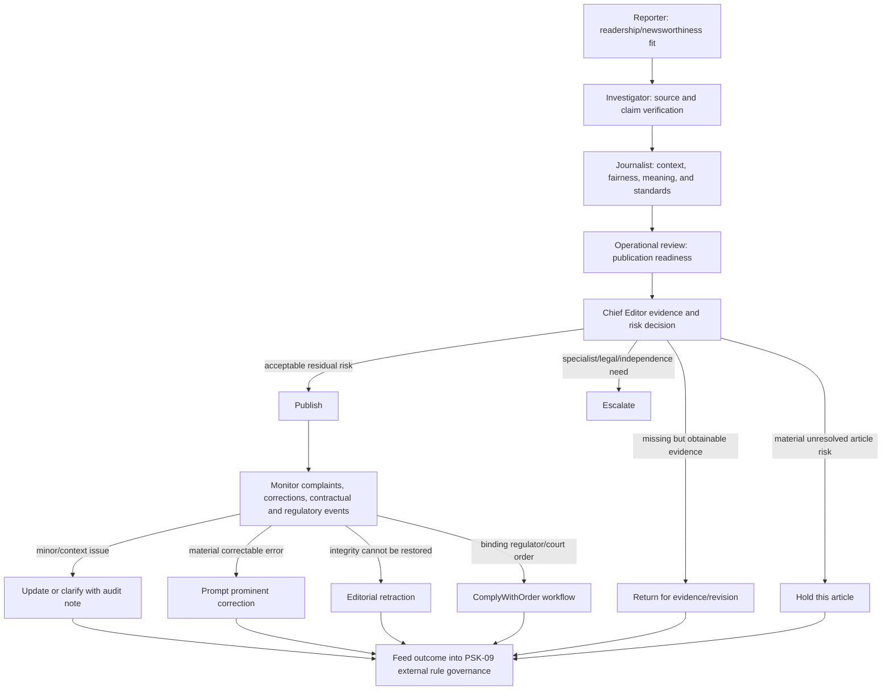

# Media-Industry SOP Fallback — Requirements Implementation Plan

**Status:** Planning only — do not build, migrate, or change runtime behaviour from this document.  
**Inputs reviewed:** `docs/Modular_PRD.md`, `docs/governance/requirements-traceability-map.md`, Charter OD2/OD4, and the current Graphify knowledge graph.  
**Objective:** Preserve publishing continuity while reducing preventable contractual exposure, corrections, retractions, and whole-pipeline halts; protect confidential sources and whistleblowers where the story serves the editorial mission and a documented public-interest test.
**Portfolio boundary:** This plan is subordinate to the [Alpha Portfolio continuity and project-closure plan](alpha-portfolio-business-continuity-implementation-plan.md); it does not change the approved `PRD.md`, frozen Charter, or retained meaning of OD4.

## 1. Clarified prompt

> Review FB-01 through FB-08 and prepare a documentation-only implementation plan. Use a defensible media-industry house SOP as the fallback wherever the project has an unresolved judgment or governance rule. Treat CR-06 newsworthiness/trend signals and CR-14 tagging as linked, core media-domain capabilities with a human/manual fallback when AI is unavailable. Redesign FR-04 so role-appropriate editorial review occurs at every phase gate, with fine-tuned judgment rules supporting—not replacing—the Chief Editor's accountable publish/hold decision. Redesign FR-05 so an unknown or inadequately evidenced OD2 status triggers a risk-based evidence and escalation loop, while an authorized negative OD2 resolution retains the Charter's pre-launch hard stop and requires a separately authorized portfolio remedy. Keep regulatory/court-ordered retraction as a separate post-publication workflow. Add a Project Scope key for every specification in the backward trace that lacks a Customer Request anchor. Include controls for contractual/liquidated-damages exposure, correction-before-retraction, continuity, and confidential-source/whistleblower protection. Do not implement code or database changes.

## 2. Primary goal

The goal is not a “risk-free” decision; no editorial system can promise that. The goal is a **risk-informed, evidence-bearing decision** whose provenance can be reconstructed:

1. the proposed story matches the intended readership and editorial mission;
2. its material claims are verified to a level proportionate to risk;
3. conflicts, source vulnerability, contractual triggers, and legal/regulatory exposure are surfaced before publication;
4. the Chief Editor sees the unresolved risk, counter-evidence, and recommended disposition;
5. one risky article can be held without stopping unrelated publishing; and
6. corrections, retractions, complaints, and overrides improve the judgment rules.

## 3. Conceptual reconstruction

### 3.1 What changes

The current feedback register treats CR-06 as a partly deliverable scoring feature and CR-14 as an uncovered AI feature. That framing is too narrow. In media work:

- **CR-06 is the newsworthiness/readership-fit decision.** It asks whether the proposed coverage is the “apple” the intended reader needs, rather than an unrelated “pear.”
- **CR-14 is the activity that produces inputs to CR-06.** AI is one executor. If AI is unavailable or below confidence, a qualified human or deterministic rules must perform the tagging and assessment.
- **Newsworthiness is not truth.** Audience fit, timeliness, impact, novelty, and momentum determine whether a story is worth pursuing. Source verification and claim substantiation determine whether it is safe and responsible to publish.
- **Review is not a single gate.** Every phase gate performs a different editorial judgment. The Chief Editor remains accountable for the final risk disposition, but should receive structured evidence from earlier gates rather than redo all work personally.
- **Independence is not a binary launch switch.** If OD2 is negative or unresolved, the system needs compensating controls, a feedback loop, and item-level escalation. A global publishing halt is reserved for systemic control failure, not one article's uncertainty.

### 3.2 Human and institutional ontology

| Layer | Construct | Meaning in this plan | Must not be conflated with |
|---|---|---|---|
| Human | Whistleblower/source | A person who may face retaliation, legal exposure, or harm | A content asset or “business input” |
| Human | Chief Editor judgment | Accountable human evaluation under uncertainty | A promise of zero risk |
| Institutional | Business alignment | Editorial mission, audience relevance, contractual duties, lawful continuity, and stated risk appetite | Commercial convenience or suppression of unwelcome facts |
| Institutional | House SOP | A codified coordination and control system derived from public standards | A universal law or substitute for counsel |
| Institutional | Judgment-rule governance under PSK-09 | Chief Editor/Board-controlled criteria, versions, evaluation, escalation, and rollback outside the systems applying the rules | OD4, an autonomous publisher, or a human conscience |
| System | OD4 — Proposer → Critics → Judge | A separately governed intra-node judgment system, considered only under its retained Charter trigger and a new project authorization | House SOP, rule-approval authority, or a replacement for the inter-node phase gates |
| Institutional | Source protection | Access controls, promises, minimization, secure handling, and escalation | Automatic publication of every allegation |

**Preserved boundary:** a confidential-source promise and the source's safety cannot be overridden merely because disclosure would be commercially convenient. “Business alignment” must be evaluated as editorial mission plus public interest and legal duty, not short-term reputational preference.

## 4. Public SOP baseline

There is no single worldwide media-industry SOP. The planned house standard should synthesize these public baselines and then add a jurisdiction/contract overlay:

| Baseline | Control adopted for planning | Source |
|---|---|---|
| Accuracy, independence, reliable news, freedom from bias | Separate editorial judgment from commercial influence; require attribution and contextual source information | [Reuters Journalistic Standards](https://reutersagency.com/about/standards-values/) and [Thomson Reuters Trust Principles](https://www.thomsonreuters.com/en/about-us/trust-principles) |
| Corroboration, right of response, manager approval for anonymous sourcing, visible corrections | High-risk or anonymous-source claims require corroboration, subject response attempts, senior approval, and explicit correction records | [Associated Press — Telling the Story](https://www.ap.org/about/news-values-and-principles/telling-the-story/) |
| Seek truth, minimize harm, act independently, be accountable | Every disposition balances evidential value, public interest, foreseeable harm, independence, and accountability | [SPJ Code of Ethics](https://www.spj.org/spj-code-of-ethics/) |
| Prompt and prominent correction; distinguish fact, comment, and conjecture; protect confidential sources | Use a correction ladder before retraction when integrity can be restored; record confidentiality terms | [IPSO Editors' Code](https://www.ipso.co.uk/editors-code-of-practice/) |
| Digital source protection | Minimize source identity data and recognize that surveillance/metadata can defeat nominal confidentiality | [UNESCO — Protecting Journalism Sources in the Digital Age](https://www.unesco.org/en/articles/unesco-releases-new-publication-protecting-journalism-sources-digital-age) |
| Contract-trigger awareness | Treat liquidated damages as contract-specific exposure, not a generic synonym for defamation or regulatory damages | [Cornell LII — Liquidated Damages](https://www.law.cornell.edu/wex/liquidated_damages) |

These are a **fallback design basis**, not legal advice and not proof that a particular publication is compliant in a particular jurisdiction.

## 5. Revised feedback-register dispositions

| Feedback | Current issue | Planned disposition | Scope/decision effect |
|---|---|---|---|
| FB-01 | Five customer gate names versus ten internal states | Keep one canonical internal state machine and map each internal state to one user-facing phase-gate label. Add a glossary; do not force the customer to use database vocabulary | Documentation normalization; no product-scope change |
| FB-02 | “Zero bypasses” split into sequence and OD2-dependent independence; negative OD2 currently implies pre-launch stop | Preserve sequence enforcement. Use the compensating-control ladder in §9 for uncertainty that does not constitute a negative OD2 resolution. Outside the Charter's OD2-negative hard stop, a whole-service stop occurs only for a defined systemic control failure; OD2-negative may trigger consideration of OD4 or another separately authorized remedy | Requires dated OD2 downstream decision and portfolio authority; Charter/OD4 text remains unchanged |
| FB-03 | Line filter added without explicit customer request | Retain as a Project Scope governance/operations view. It may remain an admin/audit filter without becoming a customer-facing MVP promise | Reclassify; no customer change request unless cost/timeline materially changes |
| FB-04 | Six unanchored specifications | Retain them only through explicit Project Scope keys PSK-01…06 in §8. Disclose product-visible effects, cost, and schedule; do not mislabel them as Customer Request | Backward trace repair |
| FB-05 | CR-14 has no FR | Plan FR-14 in §7. AI is preferred execution, not the requirement itself; manual/rules fallback is mandatory | Close as planned Product Scope gap linked to CR-06 and CR-14 |
| FB-06 | CR-06 called not deliverable in v1 | Reject the “optional scoring feature” framing. Plan a minimum viable newsworthiness assessment with manual fallback. Automated weighting may remain provisional, but the activity cannot disappear | Promote to core Product Scope capability |
| FB-07 | Missing Business Charter | Keep as non-blocking recommendation. Add a separate jurisdiction/contract/house-policy pack because those inputs are necessary for risk controls even if the upstream Business Charter never arrives | Project Scope dependency; not a customer-document mandate |
| FB-08 | One line can contain multiple requirements | Adopt atomic drafting for every new or changed requirement in this plan. Preserve current hashes until the approved document-change phase; then re-anchor intentionally | Drafting/control rule |

## 6. Planned CR-06 and CR-14 requirement model

### 6.1 CR-06 — newsworthiness/readership fit

Plan a structured assessment with independently visible dimensions:

| Dimension | Question | Fallback when automation is unavailable |
|---|---|---|
| Audience fit | Does this serve the declared Agile/DevOps/ITIL or AI readership? | Reporter selects topic/audience and records rationale |
| Timeliness/currency | Is there a current development or a justified evergreen angle? | Manual date/event check |
| Impact/significance | What decision, practice, risk, or community is affected? | Short impact statement |
| Novelty/development | What is new relative to prior coverage? | Link prior article/topic lineage |
| Source authority | Is the source positioned to know, and is it primary or independently credible? | Investigator assigns source tier with evidence |
| Corroboration/momentum | Is the signal isolated, repeated, or independently confirmed? | Record corroborating sources; absence lowers confidence but does not fabricate certainty |
| Editorial mission fit | Does the story advance the publication's stated editorial purpose? | Chief Editor-approved rubric, versioned under PSK-09 external judgment-rule governance |

The output is a **newsworthiness profile plus rationale**, not a single magical score. A score may summarize dimensions for ordering work, but it must not auto-advance a gate or substitute for verification.

### 6.2 Planned FR-14 — linked tagging activity

Proposed requirement text for later approval:

> **FR-14 — Produce the newsworthiness inputs.** At the Reporter gate, the system shall assign or propose topic, source, audience-fit, and trend/newsworthiness signals; persist the evidence and rule-set version; and route uncertain or unavailable automation to a qualified human/rules fallback. No confidence score may auto-advance the article.

Planned trace:

```text
CR-14 ──direct──▶ FR-14 ──produces inputs for──▶ CR-06 / newsworthiness assessment
CR-06 ──acceptance outcome──▶ audience-topic match and reviewable rationale
NG-10 ──constraint──▶ no auto-advance from score
PSK-09 ──supports──▶ rule-set ownership, calibration, and versioning
```

## 7. Planned FR-04 and FR-05 reconstruction

### 7.1 FR-04 — review at every phase gate

Proposed requirement direction for later approval:

> Every phase transition shall produce a role-appropriate editorial review result against the approved judgment-rule version. Earlier gates assess discovery fit, source validity, claim support, standards fit, and publication readiness. The Chief Editor receives the evidence, disagreements, unresolved risks, contractual triggers, and recommended disposition and remains accountable for `Publish`, `Hold`, or `Escalate`. Post-publication `Correct`, `Retract`, or `ComplyWithOrder` belongs to the separate remedy workflow.

This preserves the distinction between:

- **review at every gate** — performed by the responsible role or agent;
- **final accountable risk disposition** — Chief Editor;
- **regulatory/court-ordered retraction** — separate workflow with its own authority and audit trail.

The current “T5 review is executed by a Line 2 human” wording should not be deleted until the OD1 consequences are decided through the authorized downstream process. Any derived-control change must be traceable to that dated decision; the frozen Charter and approved `PRD.md` remain unchanged.

### 7.2 FR-05 — uncertain OD2 evidence path and negative OD2 hard stop

OD2 should answer whether the configured review structure produces sufficiently independent judgment. While the answer is still unknown or the evidence is inadequate, provisional evaluation should add **evidence and challenge**, not merely add another identical model call. If the authorized OD2 resolution is negative, these compensating controls do not convert it into an affirmative result: the Charter's pre-launch hard stop applies, and the Alpha Portfolio must select a separately authorized remedy, which may include considering retained OD4.

Planned compensating controls:

1. require an explicit dissent/counter-case against the proposed disposition;
2. require independent corroboration for material claims, especially anonymous-source claims;
3. seek and record a fair opportunity to reply for materially criticized subjects;
4. surface conflicts, source motives, missing evidence, and rule exceptions to the Chief Editor;
5. use a different reviewer, toolchain, prompt/rule set, or external expert where material independence is needed;
6. hold only the affected article when the uncertainty is article-specific rather than a negative OD2 resolution or systemic control failure;
7. continue unrelated articles only while the provisional operating boundary and system controls remain valid; and
8. feed overrides, corrections, complaints, retractions, and near misses into rule calibration.

OD4 remains **Proposer → Critics → Judge**, a separately governed system considered only when its existing Charter trigger fires and the Alpha Portfolio authorizes a new project. It must not be relabeled as judgment-rule governance.

The **judgment-rule lifecycle**—proposal, critique, approval, versioning, evaluation, and rollback—belongs to PSK-09 under a Chief Editor/Board authority system outside both the existing phase-gate workflow and any future OD4 system. The system applying a rule may propose evidence about that rule, but it cannot be the sole approver of the rule governing itself.

## 8. Project Scope keys for unanchored specifications

Section 5 of the traceability map should later replace “none” with a Project Scope key for every unanchored specification:

| Specification | Project Scope key | Project Scope item | Indirectly supports |
|---|---|---|---|
| FR-06 | PSK-01 | Editorial correction, return, and revision control | CR-10, CR-11, CR-19 |
| FR-11 | PSK-02 | Independent assurance and high-risk escalation | CR-19 |
| FR-12 | PSK-03 | Editorial continuity, delegation, and absence handling | CR-10, CR-12 |
| FR-13 | PSK-04 | Post-publication remedies and regulatory/court-order response | CR-12, CR-19 |
| NG-10 | PSK-05 | Human editorial accountability; no score-driven auto-bypass | CR-10, CR-19 |
| NG-11 | PSK-06 | Editorial-commercial separation and restricted solicitation | Editorial mission and legal risk indirectly |

Additional Project Scope keys required by this plan:

| Key | Project Scope item | Purpose |
|---|---|---|
| PSK-07 | Contractual obligations and liquidated-damages control | Register contracts, trigger clauses, deadlines, rights, approvals, remedies, and evidence of performance |
| PSK-08 | Confidential-source and whistleblower protection | Secure intake, identity minimization, promise terms, access control, public-interest/harm review, and legal referral |
| PSK-09 | House SOP and judgment-rule governance | Source standards, rule versions, validation cases, approval, monitoring, calibration, and rollback |
| PSK-10 | Immutable audit reporting and report reproducibility | An issued report is never edited and never deleted; a superseded report is answered by issuing a new report citing the original |

Partial anchors should show both sides rather than forcing one label:

| Specification | Customer anchor | Project Scope support |
|---|---|---|
| FR-04 | CR-10 | PSK-09; role/governance allocation remains OD1-linked |
| FR-05 | CR-19 | PSK-02 and PSK-09; OD2 governs the independence decision, while OD4 remains a separate conditional remedy only if its retained trigger fires |
| FR-10 | CR-12 | PSK-04 for correction/remedy implications after confirmation |

## 9. Planned editorial decision and remedy ladder



The key continuity rule for article-specific uncertainty is **article isolation**: `Hold` stops the affected item, not the whole publication pipeline. This rule does not override the Charter's negative-OD2 hard stop. Outside that branch, a global halt requires a systemic condition such as compromised credentials, corrupted audit integrity, a broken gate-control mechanism, or a binding order affecting the service as a whole.

## 10. Confidential-source and whistleblower lane

Planned controls under PSK-08:

1. establish on-record/background/off-record/confidential terms before substantive intake;
2. record the promise without exposing identity in the ordinary article workflow;
3. restrict identity access to the smallest authorized group; agents receive redacted evidence where possible;
4. assess retaliation, surveillance, metadata, personal-data, and jurisdiction risk;
5. test public interest and editorial-mission fit separately from commercial benefit;
6. independently verify allegations through documents, records, named sources, or corroborating confidential sources;
7. seek a fair response without revealing the source or unique identifying details;
8. require Chief Editor approval and legal/external specialist review for high-risk publication;
9. publish only the claims and source description necessary to establish credibility; and
10. preserve promises after publication, correction, litigation threat, or internal disagreement unless lawful authority and counsel determine otherwise.

“Fight for the whistleblower” is therefore reconstructed as **protect the person, test the claim, document the public interest, and resist improper pressure**. It does not mean publish an unverified allegation, and it does not mean sacrifice the source when the story becomes commercially inconvenient.

## 11. Contract and liquidated-damages planning

Liquidated damages are amounts or formulas agreed in a contract for specified breaches. Editorial SOP can reduce the probability of a triggering breach but cannot determine enforceability or eliminate exposure without the actual contract and governing law.

PSK-07 should plan a contract-obligation register containing:

| Field | Purpose |
|---|---|
| Contract/party/jurisdiction | Identify which agreement and law govern |
| Triggering obligation | Publication deadline, embargo, attribution, takedown, confidentiality, exclusivity, accuracy warranty, or other promise |
| Liquidated-damages clause | Exact clause, formula, cap, cure period, and notice requirement |
| Editorial conflict | Identify where the contract could pressure independence, source protection, correction, or public interest |
| Evidence of performance | Time-stamped approvals, source licenses, notices, corrections, and delivery records |
| Owner/escalation | Chief Editor, contract owner, external counsel, regulator/platform contact |
| Mitigation/cure | Action permitted before damages accrue or escalate |

No requirement should claim “liquidated damages reduced” until the relevant clause, breach trigger, jurisdiction, and baseline incidents are known. The measurable control is initially **contract-trigger coverage and timely escalation**, not money purportedly saved.

## 12. Guaranteed failure modes

| Failure | Why it fails | Stronger planned control |
|---|---|---|
| Treat trend score as truth | Popularity/readership fit and factual reliability are different properties | Separate newsworthiness profile from verification status |
| Require AI specifically | Makes the business capability disappear when a model fails or confidence is low | Executor-neutral requirement with human/rules fallback |
| Promise risk-free decisions | Conceals residual uncertainty and creates an impossible assurance claim | Risk disposition with evidence, residual-risk statement, and accountable owner |
| Treat every article-level OD2 concern as a formal negative OD2 resolution—or use compensating controls to ignore a formal negative result | Either converts ordinary uncertainty into outage or weakens the Charter hard stop | Item-level evidence/hold while OD2 is unknown; dated authority decision for OD2; hard stop and portfolio remedy if negative |
| Add more identical agents and call it independence | Shared model/rules can reproduce the same blind spot | Heterogeneous challenge, corroboration, external expertise, and measured disagreement quality |
| Treat retraction as the default correction | Destroys continuity and weakens the audit trail when a correction would restore integrity | Update → clarification → correction → retraction ladder |
| Subordinate source safety to “business alignment” | Collapses a human safety obligation into commercial preference and destroys institutional trust | Public-interest/mission test separated from commercial benefit; promises and access controls |
| Call every legal exposure “liquidated damages” | Contract damages, defamation, privacy, regulatory sanctions, and court orders have different triggers | Contract register plus jurisdiction-specific legal taxonomy |
| Let the work system or a future OD4 system tune and approve its own governing rules directly from production outcomes | Encodes past mistakes and business pressure without independent authority or validation | PSK-09 external rule authority, versioned evaluation set, approval, shadow testing, drift monitoring, and rollback |

## 13. Implementation sequence — documentation and design only

### Phase P0 — authority and boundary decisions

1. Confirm the publication's operating jurisdictions, regulator/platform exposure, applicable contracts, and access to external counsel.
2. Decide whether the Chief Editor is the final `Publish/Hold/Escalate` authority and whether Chief Journalist approval is advisory or operational.
3. Decide OD2's compensating-control threshold and the exact systemic conditions that halt all publishing.
4. Retain OD4 as Proposer → Critics → Judge; define PSK-09 judgment-rule governance outside the work/OD4 systems and identify who may approve rule versions.
5. Ratify the house SOP baseline and its precedence relative to customer requests, law, contracts, platform rules, and editorial independence.

**Exit:** signed decision packet; no governing document silently changed.

### Phase P1 — authorized downstream requirements and traceability changes

1. Add FR-14 and its CR-06/CR-14 traces.
2. Rewrite FR-04 and FR-05 only after P0 decisions.
3. Add PSK-01…09 and link every unanchored/partial specification in backward trace §5.
4. Revise FB-01…08 dispositions and close only those supported by an approval artifact.
5. Add atomic acceptance criteria for newsworthiness, fallback execution, gate review, item-level hold, correction, retraction, and source protection.
6. Recompute customer content anchors only if customer text itself changes; project-document edits do not rewrite customer statements.

**Exit:** a trace-complete documentation set with no requirement lacking either a CR anchor or Project Scope key.

### Phase P2 — workflow and data design

Design, but do not migrate:

- newsworthiness dimensions, evidence, executor, confidence, and rule version;
- claim/source verification and right-of-reply evidence;
- risk category, unresolved risks, Chief Editor disposition, and reason;
- item-level hold versus systemic halt;
- correction/clarification/retraction/order remedy types;
- confidential-source identity vault/reference separation;
- contract-trigger and cure/escalation records; and
- PSK-09 rule-version evaluation, external approval, monitoring, and rollback metadata; plus an explicit field showing whether an OD4 Charter trigger has fired.

**Exit:** reviewed model and threat/privacy analysis; no schema applied.

### Phase P3 — test and assurance plan

Define scenarios before build:

1. “apple versus pear” readership mismatch is rejected or retagged;
2. AI tagging unavailable routes to human/rules fallback without losing CR-06;
3. popular but unreliable content scores high on trend and fails verification;
4. article-specific independence uncertainty triggers challenge/corroboration and item-level hold, while an authorized negative OD2 resolution triggers the Charter hard stop and separate remedy decision;
5. unrelated articles continue while one article is held;
6. whistleblower allegation is protected, corroborated, and right-of-reply handled without identity leakage;
7. a correctable factual error produces a visible correction, not retraction;
8. wholly unreliable content produces editorial retraction;
9. regulator/court order uses the separate `ComplyWithOrder` workflow;
10. contract trigger alerts before the cure/notice deadline; and
11. a PSK-09 rule update fails shadow evaluation and rolls back without affecting live decisions; neither the phase-gate system nor a future OD4 system can approve its own rule change.

**Exit:** approved test plan and named evidence for every control.

### Phase P4 — build authorization gate

Building may start only after P0–P3 are approved, legal/jurisdiction questions are explicitly owned, and the project sponsor authorizes the changed scope. Until then, this plan must not be treated as a migration, feature flag, code task, or resolved Charter decision.

## 14. Preservation layer

Future revisions must preserve these distinctions:

- newsworthiness/readership fit versus truth/verification;
- AI executor versus business capability;
- review at every gate versus final Chief Editor accountability;
- item-level hold versus systemic halt;
- correction versus retraction versus compliance with an external order;
- public-interest source protection versus commercial preference;
- contract liquidated damages versus tort/regulatory/legal exposure;
- retained OD4 Proposer → Critics → Judge system versus external PSK-09 judgment-rule authority; and
- Customer Request anchors versus Project Scope support keys.

## 15. Current state

The strongest current synthesis is a continuous editorial risk-control system: CR-06 and CR-14 identify worthwhile coverage; every phase gate contributes evidence and challenge; the Chief Editor makes an accountable risk disposition; OD2 weakness invokes compensating controls rather than indiscriminate shutdown; post-publication remedies are graduated; and source protection is both a human-safety obligation and institutional trust infrastructure.

The unresolved issues are authoritative rather than technical: jurisdiction, contracts, legal escalation ownership, the Chief Editor/Chief Journalist decision boundary, OD2's acceptable compensating controls, and external PSK-09 rule ownership. OD4's meaning is not unresolved: it remains Proposer → Critics → Judge, separately considered only if its existing trigger fires and the Alpha Portfolio authorizes a distinct project. The authoritative gaps must be decided, accepted, or transferred through the portfolio closure process before implementation.
