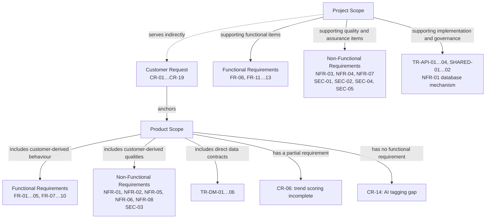

# Cleaned Requirements Scope Knowledge Graph

**Inputs:** `docs/Modular_PRD.md` and `docs/governance/requirements-traceability-map.md`  
**Method:** Graphify graph summary, document-node explanations, and targeted requirement/provenance queries; reconciled against the source tables by requirement ID.  
**Classification rule:** requirement type answers *what kind of requirement is this?* Scope answers *where did it come from and why is it funded?* The two dimensions are independent.

## Normalized hierarchy

This graph deliberately puts functional requirements in both scopes and non-functional requirements in both scopes. The scope boundary follows customer provenance, not the heading under which an item happened to be written.

## Requirement inventory

| Class found in the two inputs | IDs | Treatment |
|---|---|---|
| Customer requirements | CR-01…19 | Customer Request nodes; CR-16…18 are requested exclusions |
| Functional requirements | FR-01…13 | Reclassified below |
| Non-functional requirements | NFR-01…08 | Reclassified below |
| Security/compliance requirements | SEC-01…05 | Normalized as non-functional/security requirements |
| API requirements | TR-API-01…04 | Project implementation contracts |
| Data requirements | TR-DM-01…06 | Product Scope because they directly represent requested objects/workflow semantics; migration work remains Project Scope |
| Scope exclusions | NG-01…11 | NG-01…09 are customer-anchored Product Scope boundaries; NG-10…11 are Project Scope controls |
| Acceptance criteria | AC-01…20 | Validation nodes, not reclassified as scope requirements |
| Shared enablers | SHARED-01…02 | Project Scope |

## Reclassified functional and non-functional requirements

| Requirement | Type | Previous scope placement | Corrected scope | Customer anchor | Reason |
|---|---|---|---|---|---|
| FR-01 | Functional | Product | **Product** | CR-09 | Direct requested capability |
| FR-02 | Functional | Product | **Product** | CR-10 | Direct pipeline capability |
| FR-03 | Functional | Product | **Product** | CR-10 | Direct pipeline capability |
| FR-04 | Functional | Product | **Product — partial provenance** | CR-10 | Review gate requested; human-only execution is a Project Scope constraint |
| FR-05 | Functional | Product | **Product — partial provenance** | CR-19 | Zero-bypass outcome requested; four-eyes mechanism is Project Scope |
| FR-06 | Functional | Product | **Project** | None | Return/escalation path was added by the project team |
| FR-07 | Functional | Product | **Product** | CR-07, CR-11 | Direct audit-log capability |
| FR-08 | Functional | Product | **Product** | CR-13 | Direct board/filter capability |
| FR-09 | Functional | Product | **Product** | CR-12 | Direct publication capability |
| FR-10 | Functional | Product | **Product — elaboration** | CR-12 | Manual confirmation completes requested LinkedIn-ready flow |
| FR-11 | Functional | Product | **Project** | None | Team-added independent-assurance behaviour |
| FR-12 | Functional | Product | **Project** | None | Team-added degraded-mode behaviour |
| FR-13 | Functional | Product | **Project** | None | Team-added regulatory retraction behaviour |
| NFR-01 | Non-functional — integrity | Project | **Product outcome / Project mechanism** | CR-10, CR-19 | Invalid transitions must be rejected; choosing a Postgres trigger is implementation work |
| NFR-02 | Non-functional — auditability | Project | **Product** | CR-07, CR-11 | Immutability/completeness is a derived quality of the requested audit trail |
| NFR-03 | Non-functional — independence | Project | **Project** | CR-19 only indirectly | Team-selected independence mechanism |
| NFR-04 | Non-functional — verifiability | Project | **Project** | None | Test runner and CI are delivery assurance |
| NFR-05 | Non-functional — resilience | Project | **Product** | CR-12 | Bounded retry and ManualReady fallback are observable quality of requested publication |
| NFR-06 | Non-functional — usability | Project | **Product** | CR-13, CR-19 | Direct quality of the requested board and success volume |
| NFR-07 | Non-functional — secret handling | Project | **Project** | None | Internal security/delivery control |
| NFR-08 | Non-functional — observability | Project | **Product** | CR-07, CR-11 | Direct quality of the requested who/when/why audit trail |

## Other requirement classes

| Requirements | Corrected scope | Customer anchors or support target |
|---|---|---|
| SEC-03 | **Product** | CR-15: web-only, single Chief Editor account |
| SEC-01, SEC-02, SEC-04, SEC-05 | **Project** | Governance, credential, privacy, and legal controls supporting Product Scope |
| TR-DM-01…06 | **Product** | CR-03…08, CR-10…12, CR-19 as mapped in `Modular_PRD.md` §7.1 |
| TR-API-01…04 | **Project** | Implementation interfaces serving FR-01…10 |
| SHARED-01…02 | **Project** | Shared configuration and governance infrastructure |
| NG-01…09 | **Product boundary** | Customer-requested exclusions CR-15…18 |
| NG-10…11 | **Project boundary** | Team-added bypass and legal/compliance controls |

## Corrected provenance summary

The backward-trace inventory contains 15 classified specifications: FR-01…13 plus NG-10 and NG-11. Counted once at requirement-ID level, the corrected distribution is:

| Provenance | Count | Requirements |
|---|---:|---|
| Fully customer-anchored | 6 | FR-01, FR-02, FR-03, FR-07, FR-08, FR-09 |
| Partially customer-anchored | 3 | FR-04, FR-05, FR-10 |
| Unanchored, Project Scope | 6 | FR-06, FR-11, FR-12, FR-13, NG-10, NG-11 |
| **Total** | **15** | Counted once; no overlap |

The prior `7 / 3 / 5` summary counted FR-04 both as a whole requirement and as a sub-clause, while still saying five unanchored items in a row that named six.

## Open Product Scope gaps

| Gap | Status | Required action |
|---|---|---|
| CR-06 trend signals | Partially covered | Add the data/scoring requirements needed to compute the customer-requested signal, or obtain customer acceptance of the v1 limitation |
| CR-14 AI tagging at Reporter gate | Uncovered | Add a Product Scope FR for AI topic/source/trend tagging, or route removal from v1 to the customer through the sponsor |

