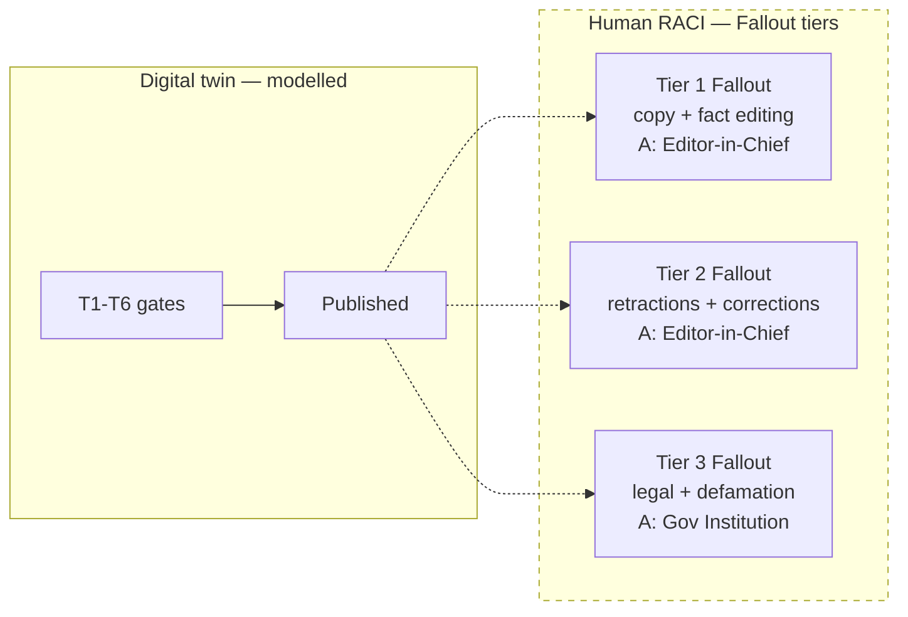
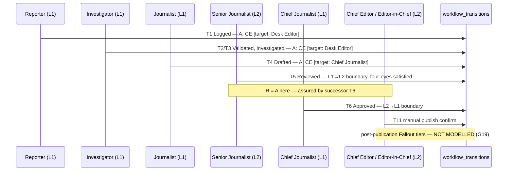

# Human Newsroom RACI versus the Digital Twin

**Date:** 2026-08-18
**Status:** Planning only. Review artifact. No code, no schema, no migration. Ratifies nothing.
**Inputs:** `Editorial_Stage_Task - Sheet1.csv` (7 stage/phase-gate tiers) and `Sheet2.csv` (8 task operations), supplied by the Chief Editor as the reference human newsroom model.
**Compared against:** `docs/governance/raci-involvement-matrix.md` v1.1 *(proposed, not ratified)*, the Addendum T1–T11 gate table, and the applied `gate_role` enum.

---

## 1. What the supplied RACI says

Eight roles across two sheets. Every Sheet1 row carries exactly one `R` and one `A` — that sheet is internally clean.

### Sheet 1 — Stage phase gates, accountability rising with risk

| Tier | R — Responsible | A — Accountable |
|---|---|---|
| Tier 1: Low-Impact Daily News Production | Reporter | **Desk Editor** |
| Tier 2: Mid-Impact Enterprise & Feature | Journalist | **Chief Journalist** |
| Tier 3: High-Impact Investigative Exploits | Investigator | **Chief Journalist** |
| Tier 1 Fallout: Low-Risk Copy & Fact Editing | Senior Journalist | **Editor-in-Chief** |
| Tier 2 Fallout: Mid-Risk Retractions & Corrections | Chief Journalist | **Editor-in-Chief** |
| Tier 3 Fallout: High-Risk Legal & Defamation Crises | Chief Journalist | **Gov Institution (GRC)** |
| Regulatory GRC Compliance & Licensing | Editor-in-Chief | **Gov Institution (GRC)** |

### Sheet 2 — Task operations

Multiple `R` is deliberate on milestone rows, per the sheet's own note. Two rows are malformed — see §3.

---

## 2. ~~The headline conflict~~ — **WITHDRAWN 2026-08-18, the two describe different layers**

> **Chief Editor clarification, and it resolves this section.** The CSV roles are **human** roles. The digital twin's `reporter, investigator, journalist, senior_journalist, chief_journalist` are **virtual agents** serving a natural person. Because the business is zero-to-one with **one** natural person, every human accountability collapses to the **Chief Editor** by default.
>
> There is therefore **no conflict.** The two documents describe different layers of the same model, and they compose exactly as `raci-involvement-matrix.md` already states — **`A` = the natural person, `R` = the agent**:
>
> | Layer | Who | RACI letter | Count in v1 |
> |---|---|---|---|
> | Human org (the CSVs) | Desk Editor, Editor-in-Chief, etc. | **`A` — Accountable** | **1** — all collapse to Chief Editor |
> | Digital twin (the gates) | The five virtual agents | **`R` — Responsible** | 5 agents |
>
> `raci-involvement-matrix.md`'s *"A is invariant — one natural person is Accountable for every task"* is **correct for v1**, not contradicted. The CSV describes the human organisation that exists once there is more than one natural person. **`G21` is withdrawn** — it was an artifact of reading both sheets as one layer.
>
> **The five phase gates are the five virtual agents.** That is why there are five: one gate per agent. `chief_editor` is the sixth `gate_role` because it is the **natural person**, not an agent.

The subsection below is retained as the record of what was compared, with its conclusion superseded by the clarification above.

### 2.1 What was compared *(superseded)*

| | `raci-involvement-matrix.md` v1.1 | Supplied CSVs |
|---|---|---|
| **Accountability** | *"**A is invariant.** One natural person is Accountable for every task in the business. That is the design intent, not an oversight."* | **Distributed across four parties**, escalating with risk: Desk Editor → Chief Journalist → Editor-in-Chief → Gov Institution |
| **C and I** | *"Unassigned… **not invented here**"* (`RACI-01`) | **Fully assigned** on every row |
| **Task unit** | The T1–T11 transitions | Risk tiers and business operations |
| **External parties** | *"Line 3 sits **outside** the matrix. It is not a RACI letter."* | **Gov Institution holds `A`** on three rows |

This is not a refinement of the existing matrix. It is a different operating model.

**Why it matters beyond bookkeeping:** the existing document's answer to `OD2` is built on A-invariance — *"it lets one natural person hold Accountability for the entire business while agents carry Responsibility,"* and *"that is precisely the operating model the Charter describes, and the reason the project can start before there are more people."* If accountability is instead distributed by risk tier, that reasoning needs rework, and `RACI-02`'s careful refusal to derive a headcount becomes harder to sustain — the CSV implies at least three distinct human accountable parties.

**Both readings are defensible.** The existing matrix describes **what is true today**: one person, agents doing the work. The CSV describes **a functioning newsroom** the business is presumably growing into. The error would be treating them as the same document.

> **Recommended framing:** the CSV is the **target-state** operating model; the RACI matrix is the **v1 collapsed** instance of it, where one natural person occupies Desk Editor, Chief Journalist, and Editor-in-Chief simultaneously. Recording it that way keeps `NG-02`'s v1 lock intact, gives `OD3` a shape to grow into, and makes the collapse explicit rather than accidental.

---

## 3. Defects found in the supplied sheets

Reported because a RACI with a missing letter fails silently — the gap only surfaces when someone needs the accountable party and cannot find one.

| Sheet | Row | Defect |
|---|---|---|
| Sheet 2 | **Drafting Standard News Copy** | **No `A`.** `R` = Reporter and Journalist, `C` = Desk Editor, everything else `I`. Every other row in both sheets names an Accountable party |
| Sheet 2 | **Final Publication Sign-Off** | **No `R`.** `A` = Editor-in-Chief, `C` = Desk Editor, everything else `I`. Arguably the `A` executes personally at a sign-off, but standard RACI still requires an `R` — and this is the single most consequential task in the sheet |

**Also worth confirming, not a defect:** *First-Line Copy Editing & Formatting* assigns `R` to the **Chief Journalist**, with the Desk Editor as `A`. Copy editing is usually a desk-level task, so this may be intentional for a small newsroom or may be a column shift. Worth one look.

**Multiple `R` outside milestone rows:** the note explains multiple `R` on the two rows marked *(Mult task R)*, but *Daily Story Pitch* and *Drafting Standard News Copy* also carry two `R`s without the marker. Harmless if intended; inconsistent if not.

---

## 4. Role mapping — human newsroom to digital twin

| CSV role | System `gate_role` | Line | Status |
|---|---|---|---|
| Reporter | `reporter` | 1 | ✅ Exact |
| Investigator | `investigator` | 1 | ✅ Exact |
| Journalist | `journalist` | 1 | ✅ Exact |
| Senior Journalist | `senior_journalist` | **2** (T5) | ✅ Exact — note the Line inversion |
| Chief Journalist | `chief_journalist` | 1 (T6, T9) | ✅ Exact |
| **Desk Editor** | — | — | ❌ **No equivalent** |
| **Editor-in-Chief** | `chief_editor` | 2 | ⚠️ **Naming mismatch, same party** |
| **Gov Institution (GRC)** | — | — | ❌ **No equivalent — see §6** |

**Five of eight map exactly.** The three that do not are the interesting ones, and each names a real structural gap.

### 4.1 Desk Editor — the delegation answer `OD1` asks for

`OD1` asks: *"Which work must the one natural person personally touch, and which can they delegate?"*

The CSV answers it. **Desk Editor is Accountable for Tier 1 daily production and for the two highest-volume task operations** — pitch tracking and fact-checking — while the Editor-in-Chief holds accountability only for fallout, corrections, and final sign-off.

That is a delegation boundary drawn at exactly the point `OD1` is unresolved. It does not *close* `OD1` — that requires a dated Charter-level act — but it is the most concrete proposal for it yet recorded.

### 4.2 Editor-in-Chief versus `chief_editor`

Same party, two names. `Editor-in-Chief` in the CSV holds the same position `chief_editor` holds in the enum: Line 2, final sign-off, accountable for corrections and crises.

> **Do not introduce `editor_in_chief` as a second enum value.** `gate_role` lives on the append-only `workflow_transitions` table; two names for one party would be permanent. Pick one label and use it in both places. The system's `chief_editor` has precedence — it is already applied SQL.

---

## 5. The missing phase — post-publication

**Three of the seven Sheet 1 tiers are "Fallout" — and the digital twin has no post-publication states at all.**

The T1–T11 gate table ends at `Published`. Its full state set is `Discovered, Logged, Validated, Investigated, Drafted, Reviewed, Approved, Published, Needs Revision, Rejected`. There is no `Corrected`, no `Retracted`, no `ComplyWithOrder`.

| CSV Fallout tier | Digital twin equivalent |
|---|---|
| Tier 1 Fallout: Low-Risk Copy & Fact Editing | ❌ none |
| Tier 2 Fallout: Mid-Risk Retractions & Corrections | ⚠️ `FR-13` only — regulatory retraction, S5, Project Scope, unanchored |
| Tier 3 Fallout: High-Risk Legal & Defamation Crises | ❌ none |

The media-SOP plan already designs the remedy ladder — Clarify → Correction → Retraction → ComplyWithOrder — but **as a plan, not as states or transitions.** So the human model has a whole phase of newsroom life, with its own accountability escalation, that the twin cannot represent.

Everything inside the dashed box exists in the human model and **nowhere in the schema**.

> **`G19` — NARROWED 2026-08-18 by Chief Editor clarification.**
>
> Post-publication is **the retraction phase**. Legal and defamation crises arise specifically from **whistleblower and fundraising activity**, and only because *the article was not retracted before the legal activity began*. Retraction is therefore the control that prevents Tier 3, not a parallel concern to it.
>
> **Tier 3 Fallout is already out of scope in v1 and the POC** — verified, not assumed:
>
> | Exclusion | Source |
> |---|---|
> | Fundraising removed from the editorial workflow **entirely**; requires independent legal and compliance review before any tooling | `NG-11` |
> | *"confidential-source or whistleblower publication without safe handling and escalation"* — excluded | PoC proposal §8.2 |
> | *"high-liability allegations without a viable external-review route"* — excluded | PoC proposal §8.2 |
> | Low-liability topic boundary for the cohort | `B-P0-06` |
>
> **Revised gap:** the twin needs **Correction and Retraction states** (Tier 1 and Tier 2 Fallout). Tier 3 needs nothing built, because the activities that generate it are excluded. `FR-13` already covers the regulatory-order case and the media-SOP ladder already designs Clarify → Correction → Retraction → ComplyWithOrder — but as a **plan**, not as states or transitions.
>
> This is distinct from `GA1` (no report record): that concerns artifacts, this concerns states. **Severity drops from "missing phase" to "two missing states,"** and the fix is bounded.

---

## 6. Gov Institution (GRC) — the category caution

The CSV assigns **`A` — Accountable** to a government institution on three rows. This deserves care, because it is simultaneously the most valuable and most hazardous entry in the sheets.

**Why it is valuable:** it is exactly the independent party the storyboard found missing. `GA6` records that the Chief Editor's disposition is a management assertion with no independent audit opinion anywhere. `Q2` asks whether Line 3 is external or absent. The CSV supplies an external authority for the highest-risk tiers — which is a real answer to a real gap.

**Why it is hazardous:** in RACI, `A` means *the party who approves the work and answers for it, with authority to say yes or no.* A regulator does not approve editorial output. The relationship runs the other way — **the newsroom is accountable *to* the regulator; the regulator is not accountable *for* the newsroom's work.**

Three consequences of recording it as `A`:

1. **It cannot be enforced.** Accountability cannot be assigned to a party that has not accepted it. The institution has not agreed to be your `A`.
2. **It reads as risk transfer.** A newsroom believing a regulator is Accountable for defamation exposure may act as though the exposure is not its own. It is.
3. **It conflates obligation with approval.** Regulatory compliance is a **constraint** on the matrix, not a role inside it.

**Recommended correction, consistent with the existing document's own treatment of Line 3:**

> `raci-involvement-matrix.md` §4 already states: *"Line 3 sits **outside** the matrix. It is not a RACI letter. It is independent assurance *over* the matrix."*

Apply the same reasoning. Model **Gov Institution (GRC) as an external authority outside the matrix** — a binding constraint with escalation triggers — and keep `A` on the **Editor-in-Chief** for Tier 3 Fallout and Regulatory Compliance, since that is who actually answers for the newsroom's conduct.

This preserves everything valuable about the CSV's intent (an external party constrains the highest-risk work) without asserting an accountability the institution has not accepted. It also keeps `Q2` honest: an external *regulator* is not the same thing as external *Line 3 assurance*, and one does not discharge the other.

---

## 7. Risk tiering — a dimension the twin does not carry

Sheet 1 is organised by impact tier. **The schema has no risk field at all** — no `risk_tier`, no `impact_level`, no sensitivity marker on `articles`.

This matters because tiering is what makes the rest of the model work:

| Depends on knowing the tier | Currently |
|---|---|
| Which accountable party applies (CSV Sheet 1) | Cannot be determined from data |
| `FR-11` — trigger a Line 3 audit on risk conditions | No input to trigger on |
| `SEC-05` — pre-publication legal review for high-sensitivity content | No way to identify high-sensitivity content |
| `B-P0-06` — the low-liability topic boundary for the POC cohort | Enforced by human judgment only |

> **New gap — `G20`: no risk-tier dimension exists.** At least four specified controls depend on knowing an article's risk tier, and nothing records it. This is `S1`-relevant: adding a tier to `articles` is cheap now; inferring it retrospectively across an append-only transition history is not.

---

## 8. Where roles attach in the dataflow

Mapping the supplied RACI onto the storyboard panels. `A` shown per the **recommended** framing of §2 and §6 — v1 collapsed onto one person, target state in brackets.

| Story panel | CSV row that governs it | Accountable (v1 → target) |
|---|---|---|
| A2 — T1 intake | Daily Story Pitch & Beat Tracking | Chief Editor → **Desk Editor** |
| A3 — T2/T3 validation | Deep Fact-Checking & OSINT Research | Chief Editor → **Desk Editor** |
| A4 — T4 drafting | Drafting Standard News Copy | ⚠️ **no `A` in the sheet** — defect §3 |
| A5 — T5 review | Legal, Ethical & Risk Review | Chief Editor → **Editor-in-Chief** |
| A6 — T6 approval | Final Publication Sign-Off | ⚠️ **no `R` in the sheet** — defect §3 |
| A7 — T7/T10/T11 publication | Final Publication Sign-Off | Chief Editor → **Editor-in-Chief** |
| A8 — T8/T9 exceptions | Crisis Management & Retractions | Chief Editor → **Editor-in-Chief** |
| **— none —** | Tier 1/2/3 Fallout | **Unmodelled — `G19`** |

**The two sheet defects land on the two most consequential panels** — drafting and final sign-off. That is not coincidence so much as confirmation that those rows deserved a second pass.

---

## 9. Effect on the register

### New gaps

| # | Gap | Severity | Phase |
|---|---|---|---|
| **G19** | **Narrowed.** No `Corrected` or `Retracted` state exists. Tier 3 Fallout needs nothing — the activities generating it (whistleblower, fundraising) are excluded by `NG-11` and PoC §8.2 | **S1-relevant** | T2 |
| **G20** | No risk-tier dimension. `FR-11`, `SEC-05`, and `B-P0-06` each depend on knowing an article's tier; nothing records it. Argument is narrower than first stated — v1 is low-liability only — but a tier added after S1 must be inferred across append-only history | **S1** | T2 |
| ~~**G21**~~ | ~~Two RACI models disagree on whether `A` is invariant~~ — **WITHDRAWN.** The CSVs are the human layer (`A`), the gates are the agent layer (`R`). No conflict; see §2 | — | — |

### What the CSVs contribute

| Register item | Contribution |
|---|---|
| `OD1` | Desk Editor is the most concrete delegation boundary yet proposed |
| `GA6` / `Q2` | Names an external authority — with the §6 correction applied |
| `OD3` | Gives a target shape (8 roles) without supplying a headcount. `RACI-02`'s no-back-derivation rule still holds |
| `RACI-01` | The CSVs **assign C and I throughout**, which `raci-involvement-matrix.md` explicitly left unassigned. This is the input that item was waiting for |

### Effect on T0

**None of the six T0 items changes.** All are documentation-only fixes to `CR-15`, the exclusivity window, `NG-02`, `PSK-10`, the immutability rule, and the assurance disclosure — none touches roles, tiers, or post-publication states.

The T0 runbook proceeds as drafted. `G19`, `G20`, and `G21` join **T2** and **T3** respectively, and `G20` in particular should be settled inside the single S1 migration design pass, since a risk tier added later must be inferred across append-only history.

---

## 10. Scope limits

Closes no Open Decision. Ratifies nothing. Amends no governing document — in particular, `raci-involvement-matrix.md` v1.1 remains *proposed, not ratified*, and this comparison does not amend it. Introduces no `gate_role` value. The recommended framings in §2 and §6 are proposals for the Chief Editor and Board; the supplied CSVs are recorded as **Chief Editor direction describing a target newsroom**, not as a statement of the system's current state.
