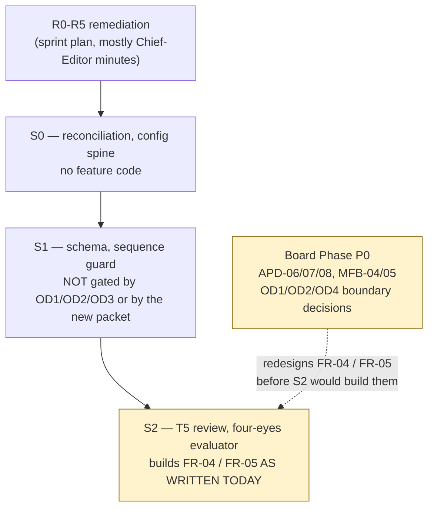

# Sprint S0 Readiness — Consolidated Analysis

**Date:** 2026-08-18
**Prepared by:** Claude, consolidating `docs/` as of commit `ea040bd` (local = origin, verified via `git ls-remote`)
**Status:** Analysis only. No application code, no migration applied, no env pulled, no commit or push made by this entry.
**Scope:** Go/no-go readiness for Sprint S0, per `docs/journal/2026-08-16-sprint-plan.md` revision 14, reconciled against everything else currently in `docs/`.

---

## 1. Method

Every file under `docs/` was read directly for this analysis rather than carried forward from session memory. `git log --name-only` was used against the last verified commit (`00d21cd`) to identify exactly what had changed and confirm nothing else had silently drifted. The one file a tooling reminder flagged as recently modified (`provisional-deviation-register.md`) was re-read in full and checked against git history: it was **not** touched by any of the new commits; its content (v1.1, D1/D3/D4 closed, D2/D5 open) matches the last verified state exactly. `docs/source/` (Charter, Addendum, Blueprint, Business Case, README) is present and unchanged.

## 2. Two things you should know before the readiness analysis

### 2a. Nine commits landed on this branch that had not been seen in this session

`e3fa9b7` through `ea040bd` sit on top of the last commit this session had produced (`00d21cd`). They add five new files under `docs/governance/` and revise two existing ones. Both local `HEAD` and `origin/docs/journal-2026-08-16` are at `ea040bd` — this work is already pushed, not local-only.

| Commit | Summary |
|---|---|
| `e3fa9b7` | Normalize requirements scope classification — bumps `Modular_PRD.md` to v1.5, adds `requirements-scope-knowledge-graph.md`, revises `requirements-traceability-map.md` to v1.2 |
| `848dcfd`, `fdfb2c1`, `d8ee722`, `80a07a9`, `635204f` | Build up `board-proposal-professional-evidence-review-poc.md` (888 lines) across five commits |
| `8ed9627` | Add `media-industry-sop-fallback-implementation-plan.md` (331 lines) |
| `6e80a73` | Add `poc-feedback-approval-crosswalk.md` (360 lines) |
| `ea040bd` | Add `alpha-portfolio-business-continuity-implementation-plan.md` (395 lines) |

All nine commits touch only `docs/` plus two agent-configuration files (`AGENTS.md`, `.codex/hooks.json`) added in `e3fa9b7`. No application code, schema, or migration is touched anywhere in this range.

### 2b. A second AI agent has been working this repo

`Modular_PRD.md`'s v1.5 changelog entry is attributed to **"Codex, Graphify-assisted requirement reconstruction"** — not Claude. The same commit that made that edit added `.codex/hooks.json` and `AGENTS.md`. `AGENTS.md` was read in full: it is the same binding build rules as this repo's `CLAUDE.md` (same "read `/docs` first," same deploy-by-git, same identity-pin rules), with Codex-specific `graphify` invocation notes swapped in. It carries nothing that conflicts with `CLAUDE.md`.

In practice this means: your `docs/` tree is now being co-edited by at least two AI agents across separate sessions (Claude Code and, per the byline, Codex). That is worth knowing, not worth alarm — every commit in the new range is docs-only, the Codex-authored edit is versioned and changelogged in the same discipline this document set already enforces, and it correctly fixes a real defect rather than introducing one (§3, below). If this continues, you may want an explicit rule for which agent is authoritative for concurrent `docs/` edits, since nothing currently arbitrates that.

## 3. What changed in the governed requirements set (already reconciled — no action needed)

`requirements-scope-knowledge-graph.md` and the `e3fa9b7` edits to `Modular_PRD.md` §7 and `requirements-traceability-map.md` correct a real double-count: the prior `7 / 3 / 5` provenance summary counted `FR-04` both as fully anchored and again through its execution constraint, while still saying "five" unanchored items in a row that named six. Recounted once at requirement-ID level:

| Provenance | Requirements |
|---|---|
| Fully customer-anchored | FR-01, FR-02, FR-03, FR-07, FR-08, FR-09 |
| Partially anchored | FR-04, FR-05, FR-10 |
| Unanchored, Project Scope | FR-06, FR-11, FR-12, FR-13, NG-10, NG-11 |

This is the same defect family as A11/FB-04 earlier in this project's history, caught and closed the same way: no open decision closed, no Charter or `PRD.md` text touched, changelog entries added to both documents (`Modular_PRD.md` v1.5, `requirements-traceability-map.md` v1.2). It also satisfies part of the sprint plan's own **R4** intent (reconcile the traceability systems). No action needed here — it is already correctly done.

One follow-on gap it opens, not yet closed: the SOP-fallback plan (§8) proposes nine Project Scope keys — `PSK-01`…`PSK-06` map 1:1 onto the six unanchored items above (a clean, ready-to-adopt resolution for **FB-04**); `PSK-07`–`PSK-09` are net-new Project Scope surface (contract/liquidated-damages control, source protection, SOP/judgment-rule governance) with no existing FB anchor. That plan explicitly says the traceability map "should **later** replace 'none' with a Project Scope key" — future tense. Neither `requirements-traceability-map.md` §5 nor `Modular_PRD.md` §7.2 has been updated with `PSK-*` labels yet. This is small, mechanical, no-build work, but it is not done.

## 4. Original gate: Sprint S0, per the sprint plan (revision 14, unchanged)

Confirmed by direct re-read; this file was not touched by any of the nine new commits.

### R0–R5 pre-sprint remediation

| Item | Status |
|---|---|
| R0 — `PRD.md` restore, `Modular_PRD.md` header, `docs/README.md` | Done |
| R0 — **A7**: `CLAUDE.md` still points at the plan pack, not the governing set | **Open** |
| R1 — ten-decision Chief Editor sitting (Q11, Q10, Q0, Q8, Q2, Q3, Q4, Q5, Q6, Q12) | **Open** — none need OD3 or counsel; estimated under an hour total |
| R2 — close deviation register D4 honestly | Depends on Q0 |
| R3 — verification apparatus (test runner, CI) | **Open**, zero dependencies — could start immediately |
| R4 — reconcile the three traceability systems | Substantially done by the `e3fa9b7` fix (§3 above); `PSK-*` propagation is unfinished follow-on |
| R5 — route FB-04, FB-05, FB-02 to the customer via the sponsor | **Open** — not yet executed as an actual communication |

### Decision requests actually open (from §8's table plus R1's batch and its exclusion note)

| # | Question | Owner | Status |
|---|---|---|---|
| Q11 `[S1-IRREVERSIBLE]` | `workflow_transitions` field rename | Chief Editor | Open — decision is minutes, propagation across `Modular_PRD.md`/sprint plan is one full pass |
| Q10 `[S1-IRREVERSIBLE]` | Tool for one Chief Editor vs. product for editorial businesses generally | Chief Editor | Open |
| Q0 | Record A2's ratification correctly in Addendum §2.4 | Chief Editor | Open — "highest value per minute on this list" |
| Q1 | Line 1 roster shape | Chief Editor | **Blocked on OD3** — not answerable by remediation |
| Q2 | Line 3 executor identity (must not be the Chief Editor) | Chief Editor | Open — needs OD3 or a one-sentence disclosure |
| Q3 | Publish path: Next.js route handler vs. Edge Function | Chief Editor | Open — recommendation stated (route handler) |
| Q4 | G9/OD2 trip-wire scope | Chief Editor | Open |
| Q5 | Retry scheduler mechanism | Chief Editor | Open |
| Q6 | Re-enable build gates once CI exists | Chief Editor | Open |
| Q7 | SEC-04/SEC-05 ownership | **No owner** | Needs external counsel; blocks production only, not Phase 0 |
| Q8 | Route FB-01…FB-08 to customer via sponsor | Chief Editor / sponsor | Resolved as a question, open as a routing task (= R5) |
| Q12 | Three Lines Model re-citation (a) and SEC-01 re-derivation (b) | Chief Editor | Open, two parts |

No `Q9` appears anywhere in the current plan — not treated here as a defect, just noted so this list isn't mistaken for a gap-free Q0–Q12 sequence.

### OD gating (unchanged)

S1 (sequence guard, schema, audit ordering) is **not gated** — "Charter-level invariant." Everything OD1/OD2-gated (T5 executor, HumanOverride, four-eyes evaluator, SC6) starts at **S2**. Everything OD3-gated (Line 1 roster, agent-failure reassignment, Line 3 identity) blocks S2 executor finalization and S4–S5 outright. S6 "cannot be called done at all" under any current OD status. Production go-live is gated on all three; Phase 0 is not.

**Bottom line for this section:** nothing in R0–R5 requires new information — R0's A7 and R1's ten decisions are Chief-Editor-owned and minutes-scale; R3 has no dependency and could start today; R5's routing is designed but not executed. This gate was already close to clear and remains so.

## 5. New gate: the Alpha Portfolio / PoC / SOP-fallback approval packet (nothing approved yet)

The five newly-discovered files build a coherent second layer on top of (not instead of) the existing plan. In its own vocabulary: the **Alpha Portfolio** is the continuing business; **AP-01** is this project (the original My-Editorial-App zero-to-one initiative, i.e. exactly what the sprint plan's S0–S6 builds); **P0-EVR** is a proposed time-boxed *manual* evidence lane (Professional Evidence Review PoC) that exercises the same five-gate design by hand, with no code changes, to gather real customer/payment evidence; **AP-02** and **AP-OD4** are conditional future projects that do not exist unless separately chartered. `PRD.md` and the frozen Charter are explicitly preserved throughout; OD4 is explicitly restored to its exact Charter meaning (Proposer → Critics → Judge) after an earlier draft had conflated it with judgment-rule governance — that governance now has its own home, `PSK-09`.

Every decision in this packet is currently **Pending**. None has been approved.

| Batch | Range | Count | Approved |
|---|---|---|---|
| Portfolio decisions | APD-01 – APD-10 | 10 | 0 |
| PoC board resolutions (core + briefcase + portfolio-boundary addenda) | B-P0-01 – B-P0-22 | 22 | 0 |
| Media-feedback disposition resolutions | MFB-01 – MFB-10 | 10 | 0 |

That is 42 proposed Board decisions, all status `Pending`, none of which this analysis — or any AI agent — has authority to close. They are Chief Editor/Board-level calls by design, consistent with the RACI model already governing this project.

**What this packet does not touch:** the PoC proposal states explicitly that "Sprint 1 … [is] unchanged by this proposal," and the invariance table in its §4 preserves the existing product, core objects, URL intake, five gates, and account boundary without modification. It is not a request to pause or replace Sprint S0/S1.

**What it does touch:** `FR-04` (review at every gate) and `FR-05` (OD2 evidence path, four-eyes) are both proposed for redesign — new text is drafted in the SOP-fallback plan §7, but explicitly marked "for later approval," and the plan's own phase sequencing (P0 authority decisions → P1 requirement rewrites → P2 design → P3 test plan → P4 build gate) has not left Phase P0. `FR-04`/`FR-05` are exactly the requirements Sprint **S2** builds against.

## 6. Where the two gates actually intersect

S0 and S1 are clean: the OD-gating table (§4 above) already states S1 is "not gated," and nothing in the new packet claims otherwise — no proposed decision in APD/B-P0/MFB names S0 or S1 as affected scope. **The fork is not "can Sprint S0 start" — it is "should Sprint S2 be built against `FR-04`/`FR-05` as currently written, or held until the Board packet's OD1/OD2/OD4-boundary items clear."** The crosswalk document's own approval-readiness table (§3 there) already sorts this correctly: it puts `FB-02`, `FR-04`, `FR-05`, `OD1`, `OD2`, and judgment-rule governance in the one tier it labels "requires authority decision plus PoC evidence" — i.e., not ready to close now, and specifically not by document review alone.

**One unmerged integration risk worth naming explicitly, since it's the kind of thing this project's own history shows gets missed:** `Q11` (§4 above) is an S1-irreversible *schema-level* rename of `judgment_independence_status`. The SOP-fallback plan's `FR-05` redesign is a *policy-level* rewrite of the same requirement — a compensating-control ladder, item-level isolation, the OD2 hard-stop boundary. Neither document currently references the other's field names or structure. They do not appear to contradict each other on the material read here, but nobody has checked them against each other line-by-line, and both are live drafts. Worth a single explicit reconciliation pass before S2, not before S0/S1.

## 7. Consolidated go/no-go

| Question | Answer |
|---|---|
| Can Sprint S0 start now? | **Yes.** Its only real dependency (R0's A7, R1's ten-item sitting) is Chief-Editor-owned and minutes-scale; nothing in the newly-discovered packet blocks it. |
| Can Sprint S1 start once S0 clears? | **Yes**, subject to Q11 and Q10 being answered first (both `[S1-IRREVERSIBLE]` — this was already true before the new material and is unchanged by it). |
| Can Sprint S2 start once S1 clears? | **Recommend holding** `FR-04`/`FR-05`-touching work until the Board has given at least an interim answer on APD-06/07/08 and MFB-04/05 (the OD1/OD2/OD4-boundary items). Building S2 against text both documents currently call provisional risks a rebuild. |
| Is the PoC (P0-EVR) itself ready to run? | **No** — it has its own 22-item Board approval gate (B-P0-01–22), all Pending, none of which this analysis can close. |
| Does anything here require code, migration, env pull, or a commit? | **No.** Everything above is a documentation/decision-routing action. |

## 8. Recommended immediate next actions (no build)

1. Fix R0's A7 — repoint `CLAUDE.md` at the governing set instead of the plan pack (mechanical; matches what `AGENTS.md` already needs corrected too, since it currently carries the same stale pointer — see §2b).
2. Hold the R1 ten-decision sitting (Q11, Q10, Q0, Q8, Q2, Q3, Q4, Q5, Q6, Q12) — the sprint plan already estimates this at under an hour.
3. Start R3 (test runner + CI) in parallel — it has no dependency on anything above and nothing in Phase 0 can be verified as "done" without it.
4. Execute R5's routing: send FB-04, FB-05, FB-02 to the customer via the sponsor — this has been "designed but not executed" across more than one prior review in this project's history.
5. Propagate `PSK-01`…`PSK-09` into `requirements-traceability-map.md` §5 and `Modular_PRD.md` §7.2 once the Chief Editor is satisfied with the SOP-fallback plan's framing — small, mechanical, closes the loop opened in §3 above.
6. Separately and at the Chief Editor's pace: work through APD-01–10, B-P0-01–22, and MFB-01–10 as a Board decision packet. None of it blocks S0; some of it (the OD1/OD2/OD4-boundary items) should land before S2 is built.
7. Before S2 specifically: do the one-pass reconciliation named in §6 between Q11's schema rename and the SOP-fallback plan's FR-05 redesign.

## 9. Source documents consolidated

| Document | Role |
|---|---|
| `docs/PRD.md` | Customer's original record — verified byte-identical to `53ace36` |
| `docs/source/project-charter-v1.md` | Frozen Charter — top of precedence |
| `docs/source/v1-build-readiness-addendum.md`, `blueprint.md`, `business-case.md` | Governing set, in precedence order below the Charter |
| `docs/Modular_PRD.md` (v1.5) | Governed spec — requirement-level traceability |
| `docs/journal/2026-08-16-sprint-plan.md` (rev. 14) | R0–R5, S0–S6, gap register, Q0–Q12, OD gating |
| `docs/governance/provisional-deviation-register.md` (v1.1) | D1–D5 departures from Charter — re-verified, no drift |
| `docs/governance/requirements-traceability-map.md` (v1.2) | CR-01…19 ↔ FR/NFR/AC, FB-01…08 |
| `docs/governance/requirements-scope-knowledge-graph.md` | Product/Project Scope reclassification, provenance fix (§3 above) |
| `docs/governance/raci-involvement-matrix.md` (v1.1) | RACI reframing, successor-node review |
| `docs/governance/alpha-portfolio-business-continuity-implementation-plan.md` | Portfolio frame, AP-01/P0-EVR/AP-02/AP-OD4, APD-01–10 |
| `docs/governance/board-proposal-professional-evidence-review-poc.md` | P0-EVR proposal + Editorial Briefcase addendum, B-P0-01–22 |
| `docs/governance/media-industry-sop-fallback-implementation-plan.md` | FR-04/FR-05 redesign draft, PSK-01–09, house-SOP baseline |
| `docs/governance/poc-feedback-approval-crosswalk.md` | FB-01–08 ↔ PoC evidence ↔ Board authority, MFB-01–10 |

---

*This entry is analysis only. It closes no open decision, ratifies nothing, and amends no governing document. It is not committed as part of being written.*

## 10. Zero-to-One Business Baseline

This section consolidates and clarifies the --existing-- zuro-to-one business-governance rules scattered across the portfolio. It creates no new requirements, but normalizes the rules among the Alpha Portfolio, OPs constraints, and technical limits.

### 10a. The Zero-to-One Business Taxonomy (Parent)
- **Alpha Portfolio:** The continuing business/investment container.
- **AP-01 Anchor Project:** The zero-to-one digital twin product (acting as a multi-tenant application per `D-73`/`D-74`).
- **P0-EVR (POC):** The manual evidence lane used to prove value before major build phases.

### 10b. Zero-to-One Operating Constraints (Child)
- **Zero-to-One Role Concentration:** As a zero-to-one business with one natural person, all human accountabilities collapse to the Chief Editor. Digital twin roles (reporter, investigator, etc.) act purely as virtual agents.
- **OD4 Boundary:** The `Proposer → Critics → Judge` system is excluded from the default zero-to-one operating baseline. It remains a separate project requiring distinct Alpha Portfolio authorization.

### 10c. Zero-to-One Technical Exclusions (Child)
- **Data Temporal History:** Maintaining full temporal history on tables (like `topics`, `sources`) is explicitly excluded as it requires "considerably more machinery than a zero-to-one business needs."
