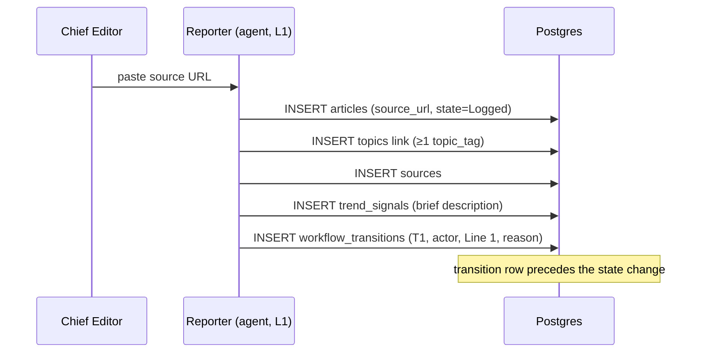
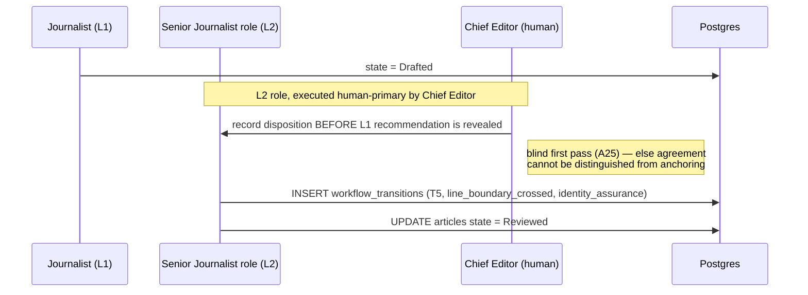
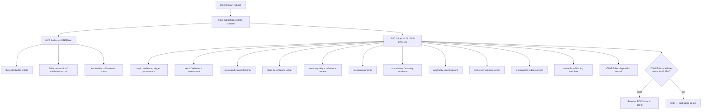

# Storyboard — The Business and Its Digital Twin

**Date:** 2026-08-18
**Status:** Planning only. Review artifact. No code, no schema, no migration.
**Purpose:** Walk both lanes end to end — MVP discovery-to-publication and POC client-commissioned research — with the data flow at each panel, so the gaps in `2026-08-18-consolidated-gaps-and-open-questions.md` become visible as *missing panels and missing records* rather than abstract register rows.
**Verified against:** `supabase/migrations/0001_init.sql` (applied enums), `docs/source/v1-build-readiness-addendum.md` §T1–T11 gate table, `docs/governance/board-proposal-professional-evidence-review-poc.md` §8.1/§16–19.

---

## 0. Vocabulary correction before the storyboard

The review request described the newsroom as *"reporters/investigators/journalist/editors/senior-editors/chief-editors **and** journalist/senior-journalist/chief-journalist"* — two parallel families.

**The governing documents define one family of six roles, and no `editor` or `senior_editor` role exists.** Verified in the applied `gate_role` enum and the Addendum's T1–T11 table:

```
reporter → investigator → journalist → senior_journalist → chief_journalist
                                                              + chief_editor
```

The structure that probably produced the "two families" impression is real, but it is not two tracks — it is **one pipeline that crosses a Line boundary twice**:

| Role | Line | Where |
|---|---|---|
| Reporter, Investigator, Journalist | **Line 1** — Operations | T1–T4 |
| **Senior Journalist** | **Line 2** — Risk & Compliance | T5 only |
| **Chief Journalist** | **Line 1** — Operations | T6, T9 |
| **Chief Editor** | **Line 2** — Risk & Compliance | T5 executor, T8 override, T11 confirm |

So "Senior Journalist" *sounds* like a Line 1 seniority step but is the Line 2 independent-review role, and "Chief Journalist" *sounds* senior to it but sits back in Line 1. That inversion is deliberate — Addendum §T5/T6: *"Line 2 provides independent review before Line 1 grants operational approval."*

> **Decision needed:** if `editor` / `senior_editor` are intended as **new roles**, that is a scope change requiring a change request and a new `gate_role` value — irreversible after S1, since `workflow_transitions` is append-only. If it was loose phrasing for the existing roles, no action. **This storyboard assumes the latter.**

---

## 1. Lane A — MVP: discovery to publication

The Chief Editor's own newsroom. No client, no payment, no exclusivity window.

### Panel A1 — Discovery *(outside the system)*

| | |
|---|---|
| **Actor** | Chief Editor |
| **Action** | Manual research, professional publications, RSS, an existing article exposing a related topic |
| **Output** | A topic candidate, then a **reviewable source URL** |
| **Records written** | *None — this happens before the system boundary* |

> **The v1 system boundary is the URL.** Nothing enters the pipeline as a bare idea. This is `CR-19`'s own success scenario: *"Chief Editor pastes a URL → article enters pipeline."*

### Panel A2 — T1 Intake *(Reporter, Line 1, Agent)*

`Discovered → Logged`

**Required at this gate:** `source_url`, ≥1 `topic_tag`, a `trend_signal` brief description. `source_author` and `source_published_date` auto-extract where possible, flagged for investigator review on failure.



> **Gap made visible — `FB-05` / `CR-14`.** A `trend_signal` is *required* at T1, but no functional requirement defines where its value comes from. `CR-14` (AI tagging at the Reporter gate) has **no FR**. The panel has a required input with no defined producer.

### Panel A3 — T2/T3 Validation and investigation *(Investigator, Line 1, Agent)*

`Logged → Validated → Investigated`

T2 confirms the URL is live, identifies `source.platform`, sets `source.reliability_tier`, confirms author and publication date. T3 runs `duplicate_check`, sets `trend_signal.evidence_url` and `reviewer_confidence`, confirms the topic against the scope boundary, identifies the `editorial_angle`.

**Four-eyes: `not_applicable`.** Both are within Line 1, and the Addendum is explicit that *the same agent may execute adjacent Line 1 gates — the standard rule, not an exception.*

### Panel A4 — T4 Drafting *(Journalist, Line 1, Agent)*

`Investigated → Drafted`

Requires `editorial_adaptation` non-empty, ≥1 `publication_targets` assigned, and the `meaning_invariance_checklist` completed.

### Panel A5 — T5 Independent review *(Senior Journalist role, **Line 2**, human-primary)*

`Drafted → Reviewed` · **four-eyes `satisfied` — Line 1 → Line 2 boundary**

This is the load-bearing panel. Requires `fact_check` passed, `taxonomy_compliance` passed, `meaning_invariance` confirmed, `editorial_quality` meets standard.



> **Three gaps converge on this panel.**
> `Q11` — the field recording independence is currently named `judgment_independence_status`, asserting a cognitive fact the system can only prove structurally. Append-only makes the wrong name permanent.
> `OD2` — whether Line separation actually produces independent judgment is unresolved; a negative answer voids this panel's model entirely.
> `GA6` — the Chief Editor executes T5 *and* is accountable for the outcome. That is a **management assertion**, not an independent audit opinion. No panel anywhere in this storyboard contains an independent assurance step.

### Panel A6 — T6 Approval *(Chief Journalist, **Line 1**, Agent)*

`Reviewed → Approved` · **four-eyes `satisfied` — Line 2 → Line 1 boundary**

Requires all prior gate criteria confirmed, `publication_targets` confirmed, `publication_time` set, `final_readthrough` complete.

> **Successor-node review (`A17`).** T6's "all prior gate criteria confirmed" is what makes T6 the reviewer of T5's judgment — it must be a real validation against T5's recorded fields, not a rubber-stamped boolean. The residual risk is the authority gradient: will a Line 1 agent actually return work to the Line 2 human? A `T6→T5` return rate that never leaves zero means review is nominal.

### Panel A7 — T7/T10/T11 Publication

| Transition | Actor | Effect |
|---|---|---|
| **T7** | System | Publication job to all targets. `Published` only when ≥1 target has a live `published_url` |
| **T10** | System auto-fallback | Target needing manual work → `ManualReady`, post content generated, article state unchanged |
| **T11** | **Chief Editor**, Line 2, human | Enters `published_url` for the manual target; first live URL flips the article to `Published` |

> **`TC2`.** A single `publication_target` enum cannot represent *"WordPress Published + LinkedIn ManualReady"* — which is the success scenario itself. `publication_targets` / `publications` tables are S1 work and do not exist yet.

### Panel A8 — T8/T9 Exceptions

**T8 Needs Revision** — any authorized role for the current state; `revision_reason` required, `revision_target_state` defaults to the immediately prior state. Also the **Chief Editor veto** path: a Line 2 override logged with `event_type = HumanOverride`.

**T9 Rejected** — Chief Journalist, Line 1, `rejection_reason` required. Terminal.

> **Where the intent vocabulary lands.** T8 and T9 both demand a reason and today take free text. This is the panel the proposed `event_type` + intent-code split serves: *"38% of returns are `SOURCE_NOT_POSITIONED`"* is a finding about Panel A2/A3; *"returned, see note"* is not.

---

## 2. Lane B — POC: client-commissioned research

Identical pipeline. Different origin, different entitlement, different delivery.

### Panel B1 — Commission *(outside the system)*

| | |
|---|---|
| **Actor** | A paying professional |
| **Action** | Brings a topic, context, experience, materials, and payment |
| **Boundary** | **The client is not an app user.** They receive a deliverable, not an account |
| **Tenancy** | **Each paying customer is its own tenant** — never grouped by shared company email domain, since a shared domain does not establish a shared legal party |

### Panel B2 — Manual pre-intake *(the panel that protects the system boundary)*

The client's topic is resolved **manually** to a reviewable public source URL *before* anything enters the pipeline.

> **This panel exists solely to stop the POC quietly changing the application's input model.** Without it, "client submits a topic" becomes "the system accepts bare topics," and Panel A1's URL boundary is gone for both lanes.

### Panels B3–B6 — T1 through T6, unchanged

**Identical to A2–A6.** Same gates, same order, same Line crossings, same logging, same four-eyes rules. The Virtual Chief Journalist assists with approved deterministic checks and **recommends only** — no publication authority, no self-modification, no gate-bypass authority.

> **The invariant:** the workflow must never fork. Two copies of the gate logic would be two editorial standards, which defeats the reason the POC exists — to exercise *the same* design.

### Panel B7 — The split *(the panel with no record home)*

On a `Publish` disposition, the final publishable article is **always** created — then the package splits.



> **`GA1` made concrete.** Every box above is a **manual folder convention**. `TR-DM-01`…`06` define articles, topics, sources, trend signals, transitions, and publication targets — **no report entity exists.** Twelve client-facing artifacts and three internal ones have nowhere to live as records. An immutable report cannot be immutable if it is not a record.

### Panel B8 — Delivery and the exclusivity window

Three data points: client-confirmed length, delivery-triggered start, calculated end.

| Field | Source |
|---|---|
| `exclusivity_window_days` | Client-confirmed; pre-filled from the Board-ratified default |
| `poc_delivery_at` | The moment the POC folder is delivered — the window's start event |
| `exclusivity_window_ends_at` | **Calculated**, not entered |

**Reaching the end date publishes nothing.** `NG-10`/`TC9` forbid auto-advance. It lifts the internal hold and permits the Chief Editor to *choose* to open a **new** workflow with a materially different angle and independently re-verified sourcing.

> **`G8` made visible.** Panels A1–A8 contain no window at all — no client, no commission, no hold. The window is a Lane B concept. Unmarked, it will be implemented in the shared core.

---

## 3. The contract boundary — what each side sees

```mermaid
flowchart LR
    subgraph NEWSROOM["Newsroom sees — full record"]
        N1["every gate transition + who/when/why"]
        N2["Line assignment + identity assurance"]
        N3["agent runs, overrides, returns"]
        N4["the publishable article"]
        N5["all other engagements + tenants"]
        N6["rule-set versions, exceptions"]
    end
    subgraph CLIENT["Client sees — their engagement only"]
        C1["their own POC folder"]
        C2["explainable public content"]
        C3["Client Decision Report"]
        C4["the disposition + rationale"]
    end
    NEWSROOM -.->|"validated exclusion"| CLIENT
```



| Question | Client | Newsroom |
|---|---|---|
| The publishable article | ❌ **Never** — disclosed before payment | ✅ In the MVP folder |
| Evidence, claims, counterarguments, uncertainty | ✅ Their engagement | ✅ All engagements |
| Explainable public content | ✅ | ✅ |
| Chief Editor `Publish/Hold/Escalate` record | ✅ Their engagement | ✅ All |
| Gate-by-gate transition log | ❌ | ✅ |
| Line assignment / independence fields | ❌ | ✅ |
| Other clients' engagements | ❌ **Tenant isolation** | ✅ |
| Judgment-rule versions and exceptions | ❌ | ✅ |
| Raw model reasoning | ❌ **Neither** — inspectability comes from sources, rule versions, classifications, reason codes and human decisions, not chain-of-thought | ❌ |

**The Client Decision Report** carries four required sections: *What we know* · *What we think* · *What we do not know* · *Why we reached this conclusion*.

> **Contract wording that must be settled before payment, not after:** the client receives the **`POC` folder and a first-publication opportunity** — not the article. The engagement record must say so plainly, or "paid for the article" creates a contradictory entitlement. Note also that folder placement decides **nothing** about copyright, licence, or ownership; those are recorded separately.

---

## 4. What the storyboard reveals

Reading both lanes end to end, the digital twin is incomplete in precisely the places the register already names — which is the useful confirmation.

| Missing from the storyboard | Register ID | Where it shows |
|---|---|---|
| No independent assurance panel exists in either lane | `GA6` | A5 — the Chief Editor reviews and attests |
| No report record — 15 artifacts are folder conventions | `GA1` | B7 |
| Required `trend_signal` at T1 has no defined producer | `FB-05`/`CR-14` | A2 |
| Return/reject reasons are free text | intent vocabulary | A8 |
| Publication cannot represent partial multi-target status | `TC2` | A7 |
| Exclusivity window is Lane B only, unmarked | `G8` | B8 vs A-lane absence |
| Client surface exists but `CR-15` reads as single-account | `G4` | B1 |
| Deleting an article destroys its transition log | `GA9` | every panel writing `workflow_transitions` |
| Tenant boundary is the isolation seam | `Q10` answered | B1 |

### How this supports T0

The storyboard is **evidence for four of the six T0 items** — each becomes a statement about an observed flow rather than an assertion:

- **`G8`** — Lane A has no window in any panel; Lane B has one at B8. The scoping statement writes itself.
- **`G4`** — Panel B1 shows the client is *never* an app user, so `CR-15`'s single-account rule is untouched by the POC surface. That is the scope note.
- **`GA6` (Step 3)** — Panel A5 shows one party reviewing and attesting, with no independent step anywhere. That is the disclosure.
- **`GA8` (Step 1)** — nothing in either lane traces audit reporting to a Customer Request, confirming `PSK-10` is Project Scope.

`G14` (the `NG-02` annotation) and **Step 2** (report immutability) are unaffected by the storyboard and proceed as drafted in the T0 runbook.

## 5. Scope limits

Closes no Open Decision. Ratifies nothing. Amends no governing document. Decides no schema. The role-vocabulary question in §0 is **raised, not resolved** — if `editor`/`senior_editor` are intended as new roles, that is a change request and an `S1`-irreversible enum decision, not a storyboard matter.
